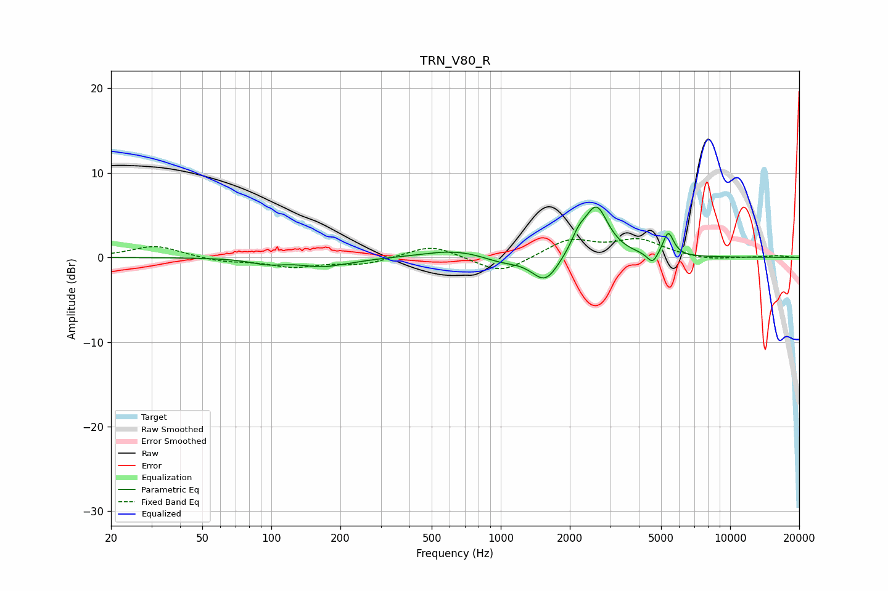

# TRN_V80_R
See [usage instructions](https://github.com/jaakkopasanen/AutoEq#usage) for more options and info.

### Parametric EQs
Apply preamp of -6.1 dB when using parametric equalizer.

|   # | Type    |   Fc (Hz) |    Q |   Gain (dB) |
|-----|---------|-----------|------|-------------|
|   1 | Peaking |        96 | 1.95 |        -0.6 |
|   2 | Peaking |       176 | 1.36 |        -1.2 |
|   3 | Peaking |       190 | 2.38 |         0.2 |
|   4 | Peaking |       625 | 1.07 |         0.9 |
|   5 | Peaking |      1007 | 1.86 |        -0.6 |
|   6 | Peaking |      1565 | 2.4  |        -3.2 |
|   7 | Peaking |      2182 | 4.4  |         1.6 |
|   8 | Peaking |      2611 | 2.7  |         5.9 |
|   9 | Peaking |      4591 | 6    |        -1.4 |
|  10 | Peaking |      5373 | 6    |         2.8 |

### Fixed Band EQs
When using fixed band (also called graphic) equalizer, apply preamp of **-2.3 dB** (if available) and set gains manually with these parameters.

|   # | Type    |   Fc (Hz) |    Q |   Gain (dB) |
|-----|---------|-----------|------|-------------|
|   1 | Peaking |        31 | 1.41 |         1.4 |
|   2 | Peaking |        62 | 1.41 |        -0.5 |
|   3 | Peaking |       125 | 1.41 |        -1   |
|   4 | Peaking |       250 | 1.41 |        -0.8 |
|   5 | Peaking |       500 | 1.41 |         1.5 |
|   6 | Peaking |      1000 | 1.41 |        -2   |
|   7 | Peaking |      2000 | 1.41 |         2.1 |
|   8 | Peaking |      4000 | 1.41 |         2   |
|   9 | Peaking |      8000 | 1.41 |        -0.4 |
|  10 | Peaking |     16000 | 1.41 |         0.2 |

### Graphs

