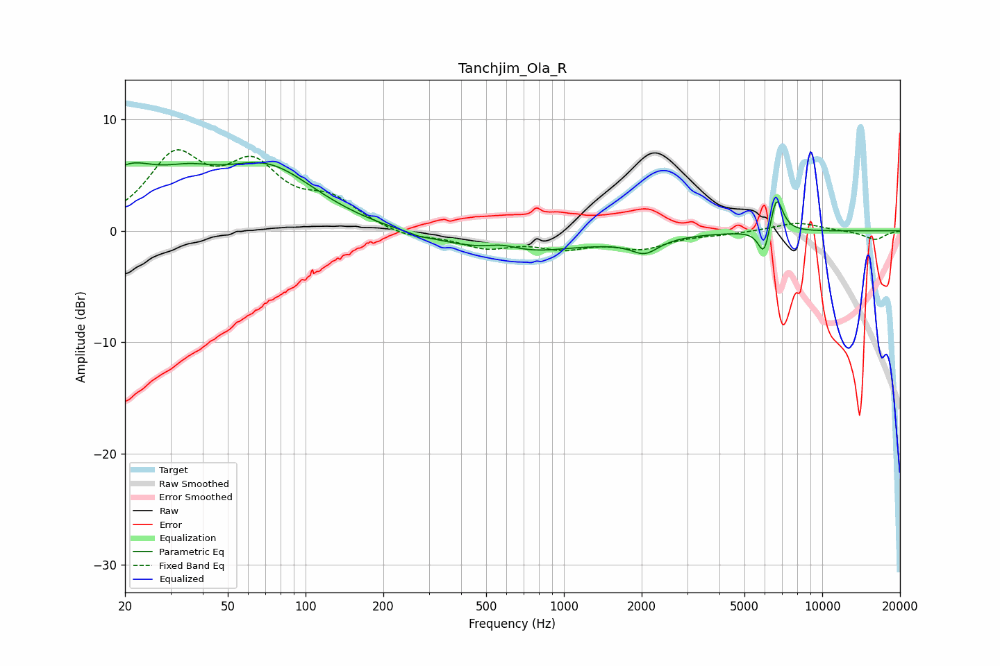

# Tanchjim_Ola_R
See [usage instructions](https://github.com/jaakkopasanen/AutoEq#usage) for more options and info.

### Parametric EQs
Apply preamp of -6.2 dB when using parametric equalizer.

|   # | Type    |   Fc (Hz) |    Q |   Gain (dB) |
|-----|---------|-----------|------|-------------|
|   1 | Peaking |        20 | 1.21 |         4.3 |
|   2 | Peaking |        35 | 1.18 |         2.3 |
|   3 | Peaking |        71 | 0.74 |         5.3 |
|   4 | Peaking |       275 | 5.97 |        -0.1 |
|   5 | Peaking |       578 | 2.35 |         0.5 |
|   6 | Peaking |       665 | 0.45 |        -2   |
|   7 | Peaking |      1087 | 1.84 |         0.1 |
|   8 | Peaking |      2056 | 2.66 |        -1.3 |
|   9 | Peaking |      5964 | 6    |        -2.7 |
|  10 | Peaking |      6640 | 5.46 |         3.5 |

### Fixed Band EQs
When using fixed band (also called graphic) equalizer, apply preamp of **-7.4 dB** (if available) and set gains manually with these parameters.

|   # | Type    |   Fc (Hz) |    Q |   Gain (dB) |
|-----|---------|-----------|------|-------------|
|   1 | Peaking |        31 | 1.41 |         6.2 |
|   2 | Peaking |        62 | 1.41 |         5.1 |
|   3 | Peaking |       125 | 1.41 |         2.4 |
|   4 | Peaking |       250 | 1.41 |        -0.7 |
|   5 | Peaking |       500 | 1.41 |        -1.4 |
|   6 | Peaking |      1000 | 1.41 |        -1.3 |
|   7 | Peaking |      2000 | 1.41 |        -1.4 |
|   8 | Peaking |      4000 | 1.41 |        -0.2 |
|   9 | Peaking |      8000 | 1.41 |         0.8 |
|  10 | Peaking |     16000 | 1.41 |        -0.8 |

### Graphs

