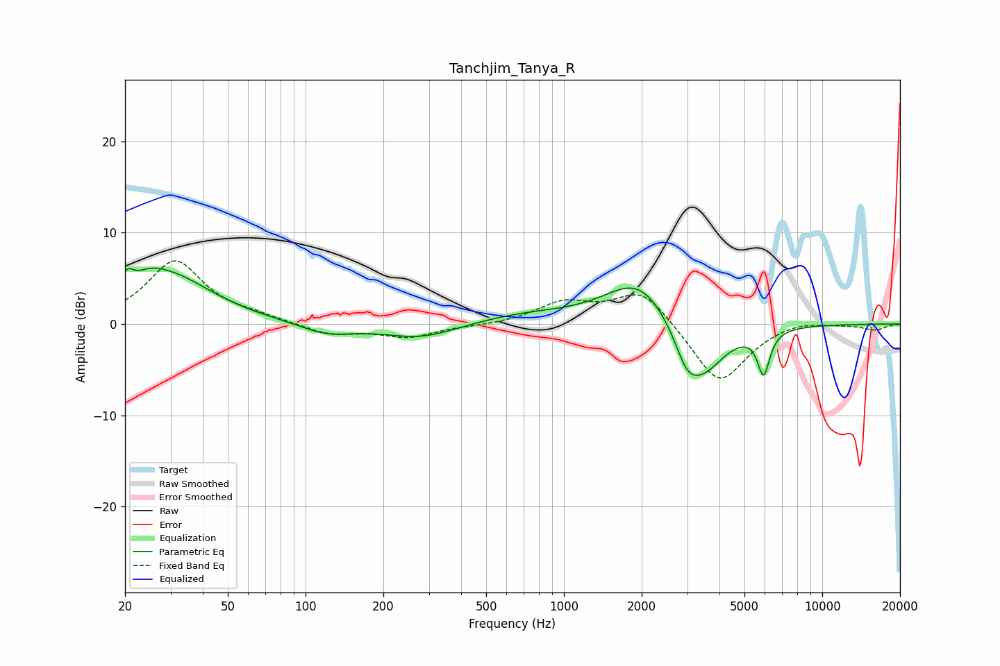

# Tanchjim_Tanya_R
See [usage instructions](https://github.com/jaakkopasanen/AutoEq#usage) for more options and info.

### Parametric EQs
Apply preamp of -6.2 dB when using parametric equalizer.

|   # | Type    |   Fc (Hz) |    Q |   Gain (dB) |
|-----|---------|-----------|------|-------------|
|   1 | Peaking |        20 | 5.72 |         1.9 |
|   2 | Peaking |        25 | 2.11 |         1.6 |
|   3 | Peaking |        30 | 0.86 |         4.8 |
|   4 | Peaking |       121 | 1.38 |        -1.2 |
|   5 | Peaking |       279 | 0.97 |        -1.7 |
|   6 | Peaking |       703 | 0.7  |         1   |
|   7 | Peaking |      1963 | 1.08 |         5.2 |
|   8 | Peaking |      2982 | 3.35 |        -2.4 |
|   9 | Peaking |      3393 | 1.52 |        -6.2 |
|  10 | Peaking |      5931 | 5.89 |        -4.7 |

### Fixed Band EQs
When using fixed band (also called graphic) equalizer, apply preamp of **-7.0 dB** (if available) and set gains manually with these parameters.

|   # | Type    |   Fc (Hz) |    Q |   Gain (dB) |
|-----|---------|-----------|------|-------------|
|   1 | Peaking |        31 | 1.41 |         6.8 |
|   2 | Peaking |        62 | 1.41 |         0.6 |
|   3 | Peaking |       125 | 1.41 |        -1.2 |
|   4 | Peaking |       250 | 1.41 |        -1.4 |
|   5 | Peaking |       500 | 1.41 |        -0.2 |
|   6 | Peaking |      1000 | 1.41 |         2.2 |
|   7 | Peaking |      2000 | 1.41 |         3.9 |
|   8 | Peaking |      4000 | 1.41 |        -6.7 |
|   9 | Peaking |      8000 | 1.41 |         0.6 |
|  10 | Peaking |     16000 | 1.41 |        -0.6 |

### Graphs

