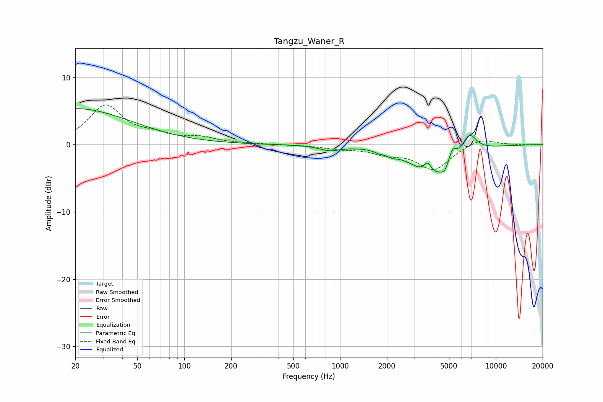

# Tangzu_Waner_R
See [usage instructions](https://github.com/jaakkopasanen/AutoEq#usage) for more options and info.

### Parametric EQs
Apply preamp of -5.5 dB when using parametric equalizer.

|   # | Type    |   Fc (Hz) |    Q |   Gain (dB) |
|-----|---------|-----------|------|-------------|
|   1 | Peaking |        20 | 0.39 |         5.4 |
|   2 | Peaking |       857 | 2.14 |        -0.7 |
|   3 | Peaking |      1780 | 5.94 |        -0.3 |
|   4 | Peaking |      2150 | 4.37 |        -0.5 |
|   5 | Peaking |      3650 | 6    |         1.7 |
|   6 | Peaking |      3857 | 1.06 |        -4   |
|   7 | Peaking |      4050 | 1.56 |        -0.7 |
|   8 | Peaking |      4688 | 6    |        -1   |
|   9 | Peaking |      5276 | 6    |         1.8 |
|  10 | Peaking |      6779 | 3.06 |         2.7 |

### Fixed Band EQs
When using fixed band (also called graphic) equalizer, apply preamp of **-6.0 dB** (if available) and set gains manually with these parameters.

|   # | Type    |   Fc (Hz) |    Q |   Gain (dB) |
|-----|---------|-----------|------|-------------|
|   1 | Peaking |        31 | 1.41 |         5.7 |
|   2 | Peaking |        62 | 1.41 |         1.1 |
|   3 | Peaking |       125 | 1.41 |         0.9 |
|   4 | Peaking |       250 | 1.41 |         0.1 |
|   5 | Peaking |       500 | 1.41 |        -0   |
|   6 | Peaking |      1000 | 1.41 |        -0.5 |
|   7 | Peaking |      2000 | 1.41 |        -1.1 |
|   8 | Peaking |      4000 | 1.41 |        -3.7 |
|   9 | Peaking |      8000 | 1.41 |         1.1 |
|  10 | Peaking |     16000 | 1.41 |        -0   |

### Graphs

