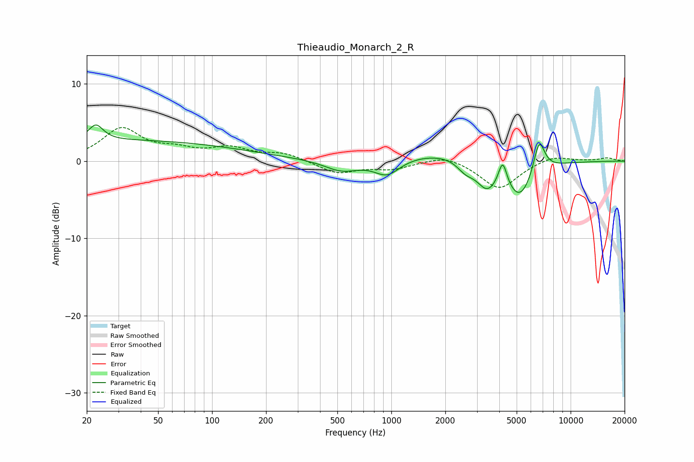

# Thieaudio_Monarch_2_R
See [usage instructions](https://github.com/jaakkopasanen/AutoEq#usage) for more options and info.

### Parametric EQs
Apply preamp of -4.8 dB when using parametric equalizer.

|   # | Type    |   Fc (Hz) |    Q |   Gain (dB) |
|-----|---------|-----------|------|-------------|
|   1 | Peaking |        22 | 3.57 |         2   |
|   2 | Peaking |        29 | 0.18 |         2.7 |
|   3 | Peaking |       529 | 1.46 |        -1.4 |
|   4 | Peaking |       947 | 2    |        -2.1 |
|   5 | Peaking |      2029 | 0.58 |         1.3 |
|   6 | Peaking |      2588 | 3    |        -1.3 |
|   7 | Peaking |      3410 | 2.34 |        -3.3 |
|   8 | Peaking |      4179 | 6    |         3.2 |
|   9 | Peaking |      5215 | 1.74 |        -4.9 |
|  10 | Peaking |      6671 | 4.26 |         4.5 |

### Fixed Band EQs
When using fixed band (also called graphic) equalizer, apply preamp of **-4.4 dB** (if available) and set gains manually with these parameters.

|   # | Type    |   Fc (Hz) |    Q |   Gain (dB) |
|-----|---------|-----------|------|-------------|
|   1 | Peaking |        31 | 1.41 |         4.1 |
|   2 | Peaking |        62 | 1.41 |         1.1 |
|   3 | Peaking |       125 | 1.41 |         1.5 |
|   4 | Peaking |       250 | 1.41 |         1   |
|   5 | Peaking |       500 | 1.41 |        -1.6 |
|   6 | Peaking |      1000 | 1.41 |        -0.9 |
|   7 | Peaking |      2000 | 1.41 |         0.9 |
|   8 | Peaking |      4000 | 1.41 |        -3.6 |
|   9 | Peaking |      8000 | 1.41 |         0.8 |
|  10 | Peaking |     16000 | 1.41 |         0.4 |

### Graphs

