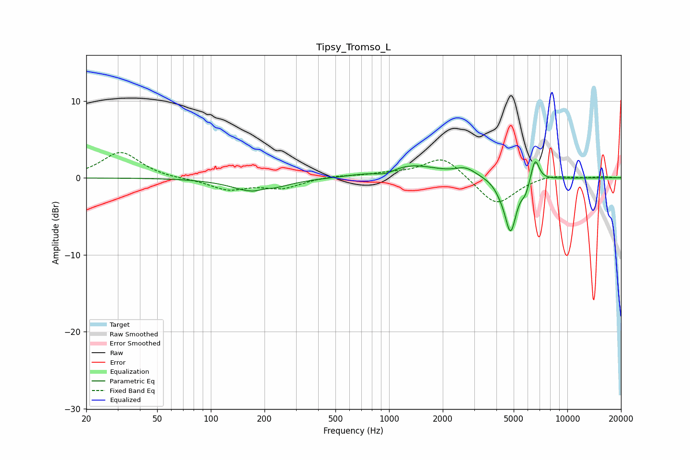

# Tipsy_Tromso_L
See [usage instructions](https://github.com/jaakkopasanen/AutoEq#usage) for more options and info.

### Parametric EQs
Apply preamp of -2.2 dB when using parametric equalizer.

|   # | Type    |   Fc (Hz) |    Q |   Gain (dB) |
|-----|---------|-----------|------|-------------|
|   1 | Peaking |       182 | 1.11 |        -1.9 |
|   2 | Peaking |       199 | 3.82 |         0.3 |
|   3 | Peaking |       644 | 1.48 |         0.1 |
|   4 | Peaking |       959 | 2.79 |        -0.6 |
|   5 | Peaking |      1328 | 0.93 |         1.7 |
|   6 | Peaking |      2692 | 2.46 |         1   |
|   7 | Peaking |      4203 | 4.09 |        -0.6 |
|   8 | Peaking |      4804 | 4.22 |        -6.8 |
|   9 | Peaking |      5821 | 6    |        -1.4 |
|  10 | Peaking |      6592 | 5.97 |         3.1 |

### Fixed Band EQs
When using fixed band (also called graphic) equalizer, apply preamp of **-3.4 dB** (if available) and set gains manually with these parameters.

|   # | Type    |   Fc (Hz) |    Q |   Gain (dB) |
|-----|---------|-----------|------|-------------|
|   1 | Peaking |        31 | 1.41 |         3.4 |
|   2 | Peaking |        62 | 1.41 |        -0.1 |
|   3 | Peaking |       125 | 1.41 |        -1.5 |
|   4 | Peaking |       250 | 1.41 |        -1.3 |
|   5 | Peaking |       500 | 1.41 |         0.3 |
|   6 | Peaking |      1000 | 1.41 |         0.5 |
|   7 | Peaking |      2000 | 1.41 |         2.8 |
|   8 | Peaking |      4000 | 1.41 |        -3.7 |
|   9 | Peaking |      8000 | 1.41 |         0.5 |
|  10 | Peaking |     16000 | 1.41 |         0.2 |

### Graphs

