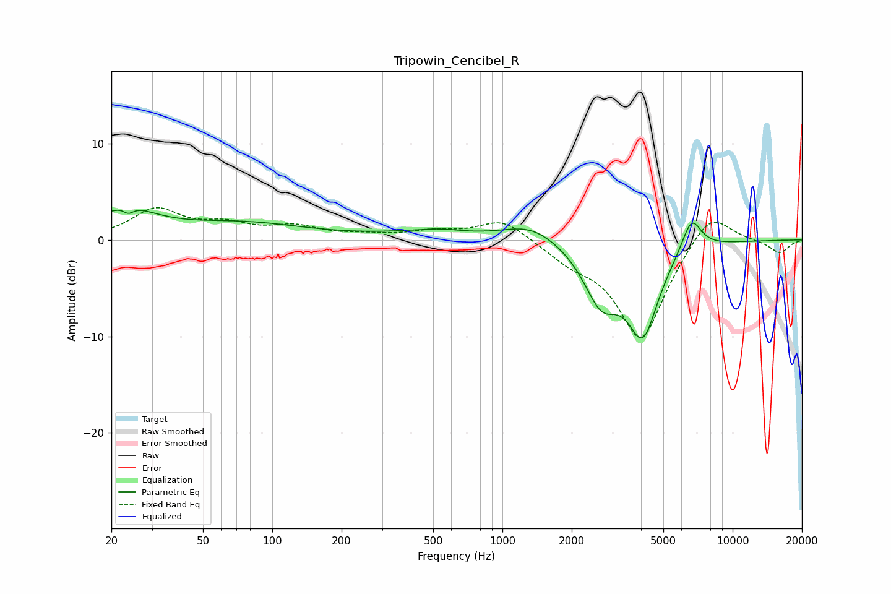

# Tripowin_Cencibel_R
See [usage instructions](https://github.com/jaakkopasanen/AutoEq#usage) for more options and info.

### Parametric EQs
Apply preamp of -3.2 dB when using parametric equalizer.

|   # | Type    |   Fc (Hz) |    Q |   Gain (dB) |
|-----|---------|-----------|------|-------------|
|   1 | Peaking |        23 | 1.09 |         2.9 |
|   2 | Peaking |        24 | 5.39 |         2.2 |
|   3 | Peaking |        24 | 5.7  |        -2.8 |
|   4 | Peaking |        74 | 0.51 |         1.6 |
|   5 | Peaking |       449 | 0.68 |         0.6 |
|   6 | Peaking |       539 | 1.64 |         0.3 |
|   7 | Peaking |      1328 | 1.18 |         1.7 |
|   8 | Peaking |      2688 | 1.82 |        -5.7 |
|   9 | Peaking |      4073 | 2.03 |        -9   |
|  10 | Peaking |      6627 | 3.17 |         3.6 |

### Fixed Band EQs
When using fixed band (also called graphic) equalizer, apply preamp of **-3.4 dB** (if available) and set gains manually with these parameters.

|   # | Type    |   Fc (Hz) |    Q |   Gain (dB) |
|-----|---------|-----------|------|-------------|
|   1 | Peaking |        31 | 1.41 |         3   |
|   2 | Peaking |        62 | 1.41 |         1.3 |
|   3 | Peaking |       125 | 1.41 |         1.2 |
|   4 | Peaking |       250 | 1.41 |         0.4 |
|   5 | Peaking |       500 | 1.41 |         0.8 |
|   6 | Peaking |      1000 | 1.41 |         2.2 |
|   7 | Peaking |      2000 | 1.41 |        -1.6 |
|   8 | Peaking |      4000 | 1.41 |       -10.4 |
|   9 | Peaking |      8000 | 1.41 |         3.5 |
|  10 | Peaking |     16000 | 1.41 |        -1.4 |

### Graphs

