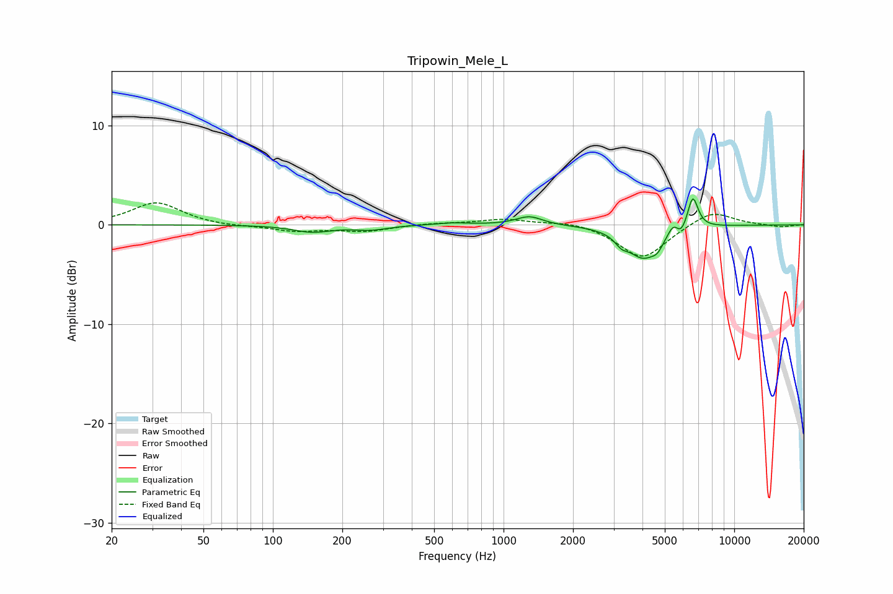

# Tripowin_Mele_L
See [usage instructions](https://github.com/jaakkopasanen/AutoEq#usage) for more options and info.

### Parametric EQs
Apply preamp of -2.7 dB when using parametric equalizer.

|   # | Type    |   Fc (Hz) |    Q |   Gain (dB) |
|-----|---------|-----------|------|-------------|
|   1 | Peaking |       148 | 1.71 |        -0.7 |
|   2 | Peaking |       266 | 1.9  |        -0.4 |
|   3 | Peaking |       599 | 1.92 |         0.2 |
|   4 | Peaking |      1293 | 2.45 |         0.9 |
|   5 | Peaking |      3241 | 5.05 |        -0.8 |
|   6 | Peaking |      4043 | 2.01 |        -3.2 |
|   7 | Peaking |      4654 | 6    |        -0.7 |
|   8 | Peaking |      5442 | 6    |         1.1 |
|   9 | Peaking |      5888 | 6    |        -0.9 |
|  10 | Peaking |      6610 | 5.91 |         3.3 |

### Fixed Band EQs
When using fixed band (also called graphic) equalizer, apply preamp of **-2.3 dB** (if available) and set gains manually with these parameters.

|   # | Type    |   Fc (Hz) |    Q |   Gain (dB) |
|-----|---------|-----------|------|-------------|
|   1 | Peaking |        31 | 1.41 |         2.3 |
|   2 | Peaking |        62 | 1.41 |        -0.2 |
|   3 | Peaking |       125 | 1.41 |        -0.6 |
|   4 | Peaking |       250 | 1.41 |        -0.6 |
|   5 | Peaking |       500 | 1.41 |         0.2 |
|   6 | Peaking |      1000 | 1.41 |         0.6 |
|   7 | Peaking |      2000 | 1.41 |         0.4 |
|   8 | Peaking |      4000 | 1.41 |        -3.4 |
|   9 | Peaking |      8000 | 1.41 |         1.5 |
|  10 | Peaking |     16000 | 1.41 |        -0.2 |

### Graphs

