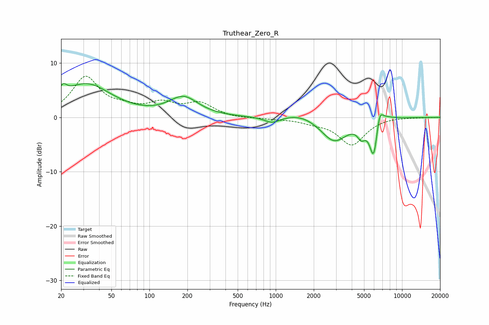

# Truthear_Zero_R
See [usage instructions](https://github.com/jaakkopasanen/AutoEq#usage) for more options and info.

### Parametric EQs
Apply preamp of -6.3 dB when using parametric equalizer.

|   # | Type    |   Fc (Hz) |    Q |   Gain (dB) |
|-----|---------|-----------|------|-------------|
|   1 | Peaking |        21 | 4.77 |         1.8 |
|   2 | Peaking |        32 | 0.72 |         6   |
|   3 | Peaking |       186 | 1.24 |         3.5 |
|   4 | Peaking |       933 | 2.35 |        -1.1 |
|   5 | Peaking |      1596 | 1.13 |         1   |
|   6 | Peaking |      2899 | 1.36 |        -4.4 |
|   7 | Peaking |      4761 | 4.5  |        -2.1 |
|   8 | Peaking |      5962 | 4.21 |        -7.3 |
|   9 | Peaking |      6623 | 5.39 |         3   |
|  10 | Peaking |      7031 | 2.07 |         1.2 |

### Fixed Band EQs
When using fixed band (also called graphic) equalizer, apply preamp of **-7.7 dB** (if available) and set gains manually with these parameters.

|   # | Type    |   Fc (Hz) |    Q |   Gain (dB) |
|-----|---------|-----------|------|-------------|
|   1 | Peaking |        31 | 1.41 |         7.2 |
|   2 | Peaking |        62 | 1.41 |         1.2 |
|   3 | Peaking |       125 | 1.41 |         2.2 |
|   4 | Peaking |       250 | 1.41 |         2.4 |
|   5 | Peaking |       500 | 1.41 |        -0.2 |
|   6 | Peaking |      1000 | 1.41 |        -0.2 |
|   7 | Peaking |      2000 | 1.41 |        -0.7 |
|   8 | Peaking |      4000 | 1.41 |        -5   |
|   9 | Peaking |      8000 | 1.41 |         0.1 |
|  10 | Peaking |     16000 | 1.41 |        -0   |

### Graphs

