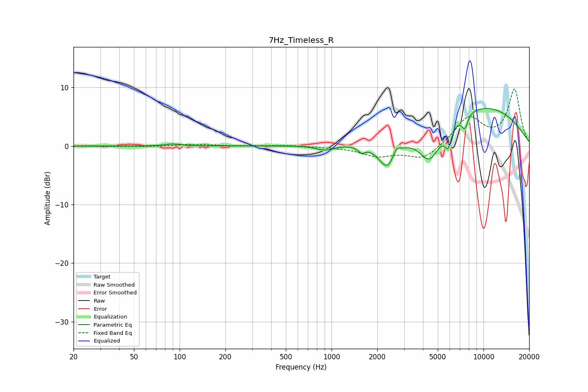

# 7Hz_Timeless_R
See [usage instructions](https://github.com/jaakkopasanen/AutoEq#usage) for more options and info.

### Parametric EQs
Apply preamp of -6.5 dB when using parametric equalizer.

|   # | Type    |   Fc (Hz) |    Q |   Gain (dB) |
|-----|---------|-----------|------|-------------|
|   1 | Peaking |        90 | 3    |         0.3 |
|   2 | Peaking |       905 | 2.39 |        -0.8 |
|   3 | Peaking |      1577 | 5.92 |        -1   |
|   4 | Peaking |      2333 | 2.34 |        -5   |
|   5 | Peaking |      2670 | 6    |         1.5 |
|   6 | Peaking |      4431 | 1.85 |        -6.3 |
|   7 | Peaking |      5858 | 6    |        -3.3 |
|   8 | Peaking |      7555 | 6    |        -2.6 |
|   9 | Peaking |      7912 | 5.93 |         0.3 |
|  10 | Peaking |      9189 | 0.34 |         7   |

### Fixed Band EQs
When using fixed band (also called graphic) equalizer, apply preamp of **-9.8 dB** (if available) and set gains manually with these parameters.

|   # | Type    |   Fc (Hz) |    Q |   Gain (dB) |
|-----|---------|-----------|------|-------------|
|   1 | Peaking |        31 | 1.41 |        -0.1 |
|   2 | Peaking |        62 | 1.41 |        -0.1 |
|   3 | Peaking |       125 | 1.41 |         0.3 |
|   4 | Peaking |       250 | 1.41 |        -0   |
|   5 | Peaking |       500 | 1.41 |         0.1 |
|   6 | Peaking |      1000 | 1.41 |        -0.1 |
|   7 | Peaking |      2000 | 1.41 |        -1.6 |
|   8 | Peaking |      4000 | 1.41 |        -2.3 |
|   9 | Peaking |      8000 | 1.41 |         4.8 |
|  10 | Peaking |     16000 | 1.41 |         9.6 |

### Graphs

