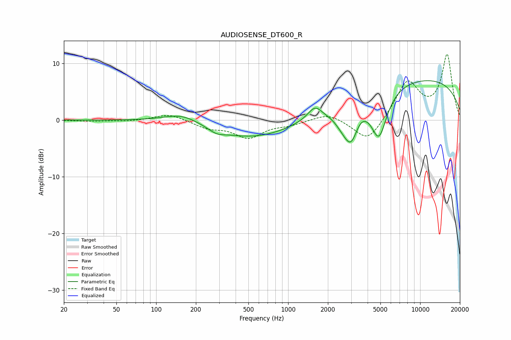

# AUDIOSENSE_DT600_R
See [usage instructions](https://github.com/jaakkopasanen/AutoEq#usage) for more options and info.

### Parametric EQs
Apply preamp of -7.1 dB when using parametric equalizer.

|   # | Type    |   Fc (Hz) |    Q |   Gain (dB) |
|-----|---------|-----------|------|-------------|
|   1 | Peaking |       157 | 1.03 |         1.7 |
|   2 | Peaking |       287 | 2.3  |        -0.8 |
|   3 | Peaking |       544 | 0.47 |        -3.2 |
|   4 | Peaking |      1604 | 2.62 |         2.4 |
|   5 | Peaking |      1773 | 2.12 |        -0.3 |
|   6 | Peaking |      2595 | 2.17 |        -2.3 |
|   7 | Peaking |      3001 | 2.69 |        -5.3 |
|   8 | Peaking |      3541 | 3.43 |         0.5 |
|   9 | Peaking |      4874 | 2.26 |        -8.2 |
|  10 | Peaking |      9664 | 0.22 |         7.4 |

### Fixed Band EQs
When using fixed band (also called graphic) equalizer, apply preamp of **-11.7 dB** (if available) and set gains manually with these parameters.

|   # | Type    |   Fc (Hz) |    Q |   Gain (dB) |
|-----|---------|-----------|------|-------------|
|   1 | Peaking |        31 | 1.41 |        -0.2 |
|   2 | Peaking |        62 | 1.41 |        -0.2 |
|   3 | Peaking |       125 | 1.41 |         1.2 |
|   4 | Peaking |       250 | 1.41 |        -1.3 |
|   5 | Peaking |       500 | 1.41 |        -2.9 |
|   6 | Peaking |      1000 | 1.41 |        -0.7 |
|   7 | Peaking |      2000 | 1.41 |         1.3 |
|   8 | Peaking |      4000 | 1.41 |        -4.1 |
|   9 | Peaking |      8000 | 1.41 |         6.7 |
|  10 | Peaking |     16000 | 1.41 |        11.4 |

### Graphs

