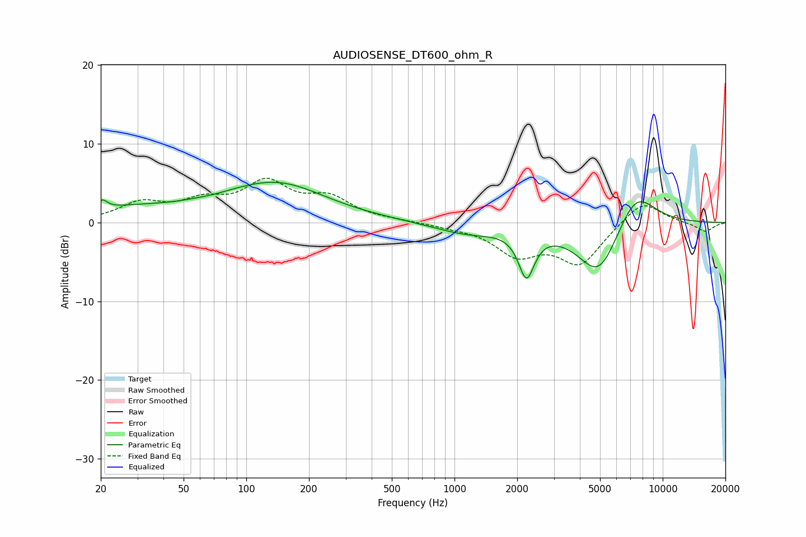

# AUDIOSENSE_DT600_ohm_R
See [usage instructions](https://github.com/jaakkopasanen/AutoEq#usage) for more options and info.

### Parametric EQs
Apply preamp of -5.2 dB when using parametric equalizer.

|   # | Type    |   Fc (Hz) |    Q |   Gain (dB) |
|-----|---------|-----------|------|-------------|
|   1 | Peaking |        20 | 5.97 |         1.2 |
|   2 | Peaking |        27 | 0.61 |         1.6 |
|   3 | Peaking |        67 | 1.47 |         0.6 |
|   4 | Peaking |        68 | 2.08 |        -0.4 |
|   5 | Peaking |       140 | 0.57 |         5   |
|   6 | Peaking |       264 | 0.9  |        -0.2 |
|   7 | Peaking |      1151 | 0.9  |        -1.4 |
|   8 | Peaking |      2217 | 3.71 |        -5.8 |
|   9 | Peaking |      4940 | 1.35 |        -7.2 |
|  10 | Peaking |      7364 | 1.37 |         5.2 |

### Fixed Band EQs
When using fixed band (also called graphic) equalizer, apply preamp of **-5.7 dB** (if available) and set gains manually with these parameters.

|   # | Type    |   Fc (Hz) |    Q |   Gain (dB) |
|-----|---------|-----------|------|-------------|
|   1 | Peaking |        31 | 1.41 |         2.3 |
|   2 | Peaking |        62 | 1.41 |         2.2 |
|   3 | Peaking |       125 | 1.41 |         4.6 |
|   4 | Peaking |       250 | 1.41 |         2.8 |
|   5 | Peaking |       500 | 1.41 |         0.2 |
|   6 | Peaking |      1000 | 1.41 |        -0.4 |
|   7 | Peaking |      2000 | 1.41 |        -3.8 |
|   8 | Peaking |      4000 | 1.41 |        -5.1 |
|   9 | Peaking |      8000 | 1.41 |         3   |
|  10 | Peaking |     16000 | 1.41 |        -1.2 |

### Graphs

