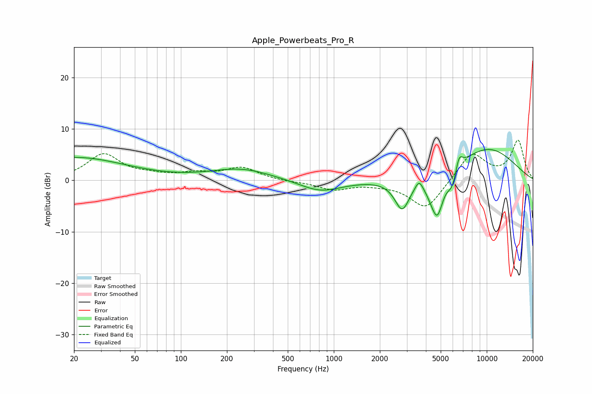

# Apple_Powerbeats_Pro_R
See [usage instructions](https://github.com/jaakkopasanen/AutoEq#usage) for more options and info.

### Parametric EQs
Apply preamp of -6.1 dB when using parametric equalizer.

|   # | Type    |   Fc (Hz) |    Q |   Gain (dB) |
|-----|---------|-----------|------|-------------|
|   1 | Peaking |        20 | 0.42 |         4.5 |
|   2 | Peaking |       247 | 0.71 |         2.2 |
|   3 | Peaking |       816 | 1.03 |        -2.3 |
|   4 | Peaking |      2798 | 2.88 |        -6   |
|   5 | Peaking |      3607 | 6    |         1.8 |
|   6 | Peaking |      4347 | 3.38 |        -1.5 |
|   7 | Peaking |      4759 | 3.45 |        -7.5 |
|   8 | Peaking |      5943 | 4.23 |        -3.4 |
|   9 | Peaking |      6590 | 6    |         2.8 |
|  10 | Peaking |     10000 | 0.56 |         6.3 |

### Fixed Band EQs
When using fixed band (also called graphic) equalizer, apply preamp of **-7.9 dB** (if available) and set gains manually with these parameters.

|   # | Type    |   Fc (Hz) |    Q |   Gain (dB) |
|-----|---------|-----------|------|-------------|
|   1 | Peaking |        31 | 1.41 |         5   |
|   2 | Peaking |        62 | 1.41 |         0.7 |
|   3 | Peaking |       125 | 1.41 |         1.1 |
|   4 | Peaking |       250 | 1.41 |         2.4 |
|   5 | Peaking |       500 | 1.41 |        -0.2 |
|   6 | Peaking |      1000 | 1.41 |        -1.7 |
|   7 | Peaking |      2000 | 1.41 |        -0.5 |
|   8 | Peaking |      4000 | 1.41 |        -5.7 |
|   9 | Peaking |      8000 | 1.41 |         5.5 |
|  10 | Peaking |     16000 | 1.41 |         7.7 |

### Graphs

