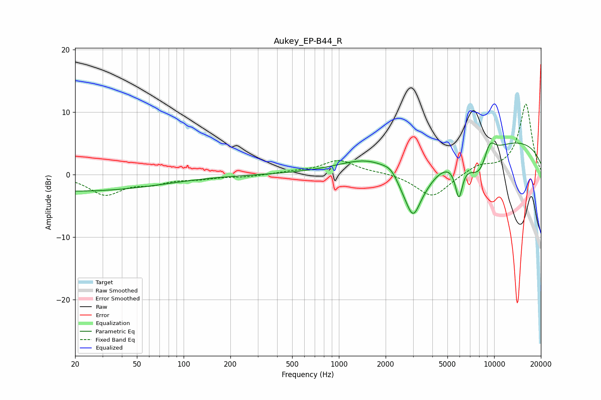

# Aukey_EP-B44_R
See [usage instructions](https://github.com/jaakkopasanen/AutoEq#usage) for more options and info.

### Parametric EQs
Apply preamp of -5.2 dB when using parametric equalizer.

|   # | Type    |   Fc (Hz) |    Q |   Gain (dB) |
|-----|---------|-----------|------|-------------|
|   1 | Peaking |        20 | 0.25 |        -2.6 |
|   2 | Peaking |      1700 | 0.73 |         2.5 |
|   3 | Peaking |      2186 | 2.84 |         1.5 |
|   4 | Peaking |      2966 | 1.17 |        -9.4 |
|   5 | Peaking |      3003 | 6    |         0.9 |
|   6 | Peaking |      3005 | 4.55 |        -3.3 |
|   7 | Peaking |      5926 | 5.84 |        -5.5 |
|   8 | Peaking |      8114 | 1.6  |        -5.3 |
|   9 | Peaking |      9321 | 3.24 |         3.4 |
|  10 | Peaking |      9512 | 0.19 |         6   |

### Fixed Band EQs
When using fixed band (also called graphic) equalizer, apply preamp of **-11.4 dB** (if available) and set gains manually with these parameters.

|   # | Type    |   Fc (Hz) |    Q |   Gain (dB) |
|-----|---------|-----------|------|-------------|
|   1 | Peaking |        31 | 1.41 |        -3.1 |
|   2 | Peaking |        62 | 1.41 |        -1.1 |
|   3 | Peaking |       125 | 1.41 |        -0.5 |
|   4 | Peaking |       250 | 1.41 |        -0.3 |
|   5 | Peaking |       500 | 1.41 |         0.4 |
|   6 | Peaking |      1000 | 1.41 |         2.3 |
|   7 | Peaking |      2000 | 1.41 |         0.3 |
|   8 | Peaking |      4000 | 1.41 |        -3.7 |
|   9 | Peaking |      8000 | 1.41 |         1.4 |
|  10 | Peaking |     16000 | 1.41 |        11.3 |

### Graphs

