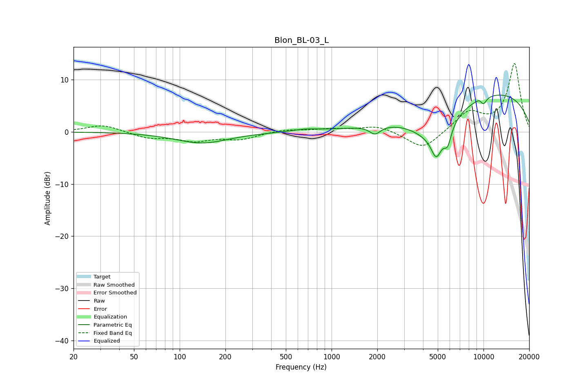

# Blon_BL-03_L
See [usage instructions](https://github.com/jaakkopasanen/AutoEq#usage) for more options and info.

### Parametric EQs
Apply preamp of -7.2 dB when using parametric equalizer.

|   # | Type    |   Fc (Hz) |    Q |   Gain (dB) |
|-----|---------|-----------|------|-------------|
|   1 | Peaking |       140 | 0.81 |        -2.1 |
|   2 | Peaking |       676 | 1.65 |         0.4 |
|   3 | Peaking |      1933 | 3.93 |        -1.6 |
|   4 | Peaking |      4744 | 0.93 |        -6.5 |
|   5 | Peaking |      4892 | 4.17 |        -4.2 |
|   6 | Peaking |      5807 | 5.49 |        -3.3 |
|   7 | Peaking |      9459 | 5.82 |         0.5 |
|   8 | Peaking |      9976 | 5.9  |        -1.4 |
|   9 | Peaking |     10000 | 0.21 |         3.9 |
|  10 | Peaking |     10000 | 0.27 |         4.2 |

### Fixed Band EQs
When using fixed band (also called graphic) equalizer, apply preamp of **-13.2 dB** (if available) and set gains manually with these parameters.

|   # | Type    |   Fc (Hz) |    Q |   Gain (dB) |
|-----|---------|-----------|------|-------------|
|   1 | Peaking |        31 | 1.41 |         1.4 |
|   2 | Peaking |        62 | 1.41 |        -1.1 |
|   3 | Peaking |       125 | 1.41 |        -1.6 |
|   4 | Peaking |       250 | 1.41 |        -1.3 |
|   5 | Peaking |       500 | 1.41 |         0.5 |
|   6 | Peaking |      1000 | 1.41 |         0.5 |
|   7 | Peaking |      2000 | 1.41 |         1.2 |
|   8 | Peaking |      4000 | 1.41 |        -3.5 |
|   9 | Peaking |      8000 | 1.41 |         3.7 |
|  10 | Peaking |     16000 | 1.41 |        13.1 |

### Graphs

