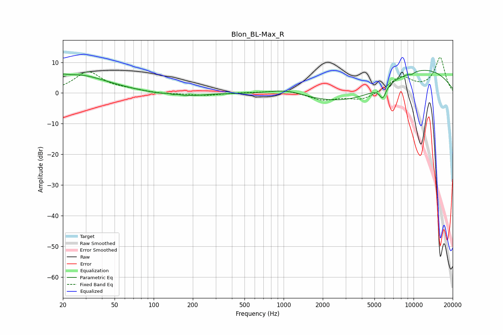

# Blon_BL-Max_R
See [usage instructions](https://github.com/jaakkopasanen/AutoEq#usage) for more options and info.

### Parametric EQs
Apply preamp of -7.5 dB when using parametric equalizer.

|   # | Type    |   Fc (Hz) |    Q |   Gain (dB) |
|-----|---------|-----------|------|-------------|
|   1 | Peaking |        20 | 5.08 |         0.8 |
|   2 | Peaking |        26 | 0.61 |         5.9 |
|   3 | Peaking |       140 | 5.7  |        -1.1 |
|   4 | Peaking |       140 | 3.27 |         1.7 |
|   5 | Peaking |       151 | 0.97 |        -1.7 |
|   6 | Peaking |      1062 | 0.99 |         2.2 |
|   7 | Peaking |      3733 | 0.4  |        -7.2 |
|   8 | Peaking |      5792 | 5.62 |        -3.9 |
|   9 | Peaking |      9604 | 0.31 |        10.1 |
|  10 | Peaking |      9648 | 5.91 |        -0.6 |

### Fixed Band EQs
When using fixed band (also called graphic) equalizer, apply preamp of **-11.7 dB** (if available) and set gains manually with these parameters.

|   # | Type    |   Fc (Hz) |    Q |   Gain (dB) |
|-----|---------|-----------|------|-------------|
|   1 | Peaking |        31 | 1.41 |         6.8 |
|   2 | Peaking |        62 | 1.41 |         0.8 |
|   3 | Peaking |       125 | 1.41 |        -0.4 |
|   4 | Peaking |       250 | 1.41 |        -0.8 |
|   5 | Peaking |       500 | 1.41 |         0.1 |
|   6 | Peaking |      1000 | 1.41 |         1.1 |
|   7 | Peaking |      2000 | 1.41 |        -2.3 |
|   8 | Peaking |      4000 | 1.41 |        -2.4 |
|   9 | Peaking |      8000 | 1.41 |         5   |
|  10 | Peaking |     16000 | 1.41 |        11.4 |

### Graphs

