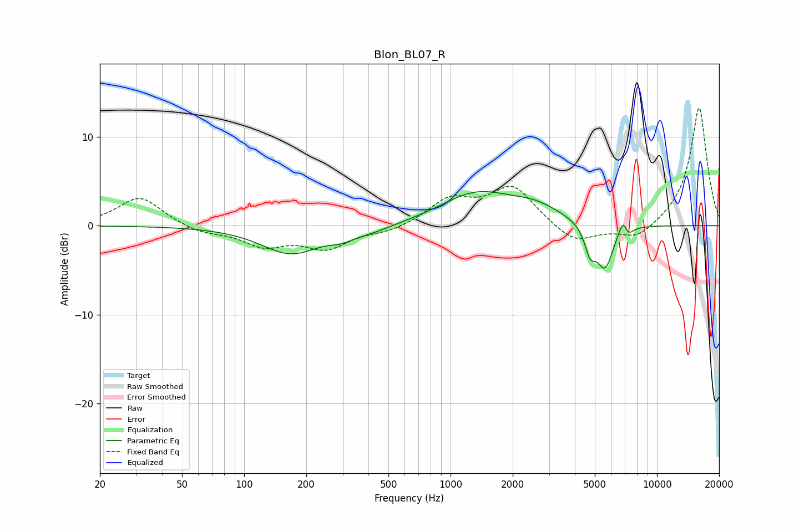

# Blon_BL07_R
See [usage instructions](https://github.com/jaakkopasanen/AutoEq#usage) for more options and info.

### Parametric EQs
Apply preamp of -3.9 dB when using parametric equalizer.

|   # | Type    |   Fc (Hz) |    Q |   Gain (dB) |
|-----|---------|-----------|------|-------------|
|   1 | Peaking |       168 | 0.99 |        -3.1 |
|   2 | Peaking |       293 | 3.09 |        -0.5 |
|   3 | Peaking |       385 | 1.12 |        -0.8 |
|   4 | Peaking |      1337 | 0.8  |         3.5 |
|   5 | Peaking |      2601 | 1.11 |         1.6 |
|   6 | Peaking |      4740 | 5.44 |        -2.7 |
|   7 | Peaking |      5512 | 5.59 |         0.3 |
|   8 | Peaking |      5584 | 3.43 |        -5.3 |
|   9 | Peaking |      6875 | 5.96 |         2   |
|  10 | Peaking |      7216 | 6    |        -1.2 |

### Fixed Band EQs
When using fixed band (also called graphic) equalizer, apply preamp of **-13.3 dB** (if available) and set gains manually with these parameters.

|   # | Type    |   Fc (Hz) |    Q |   Gain (dB) |
|-----|---------|-----------|------|-------------|
|   1 | Peaking |        31 | 1.41 |         3.3 |
|   2 | Peaking |        62 | 1.41 |        -0.8 |
|   3 | Peaking |       125 | 1.41 |        -2.1 |
|   4 | Peaking |       250 | 1.41 |        -2.4 |
|   5 | Peaking |       500 | 1.41 |        -0.7 |
|   6 | Peaking |      1000 | 1.41 |         2.8 |
|   7 | Peaking |      2000 | 1.41 |         4.3 |
|   8 | Peaking |      4000 | 1.41 |        -2.1 |
|   9 | Peaking |      8000 | 1.41 |        -1.7 |
|  10 | Peaking |     16000 | 1.41 |        13.4 |

### Graphs

