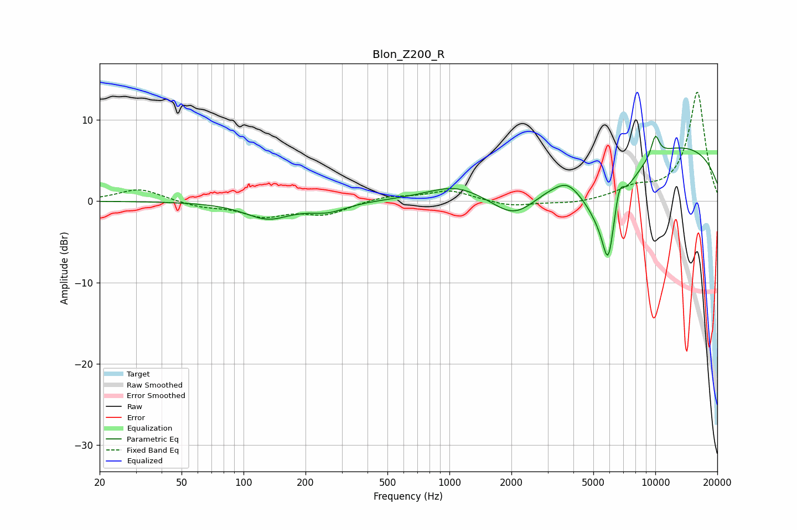

# Blon_Z200_R
See [usage instructions](https://github.com/jaakkopasanen/AutoEq#usage) for more options and info.

### Parametric EQs
Apply preamp of -8.1 dB when using parametric equalizer.

|   # | Type    |   Fc (Hz) |    Q |   Gain (dB) |
|-----|---------|-----------|------|-------------|
|   1 | Peaking |       131 | 1.27 |        -2.1 |
|   2 | Peaking |       257 | 1.57 |        -1.1 |
|   3 | Peaking |      1056 | 1.16 |         1.3 |
|   4 | Peaking |      2092 | 1.11 |        -4.8 |
|   5 | Peaking |      3733 | 2.66 |         1   |
|   6 | Peaking |      5791 | 1.25 |        -9.3 |
|   7 | Peaking |      5905 | 5.34 |        -5.3 |
|   8 | Peaking |      6669 | 5.78 |         3.3 |
|   9 | Peaking |      9137 | 0.19 |         7.7 |
|  10 | Peaking |     10000 | 6    |         2.7 |

### Fixed Band EQs
When using fixed band (also called graphic) equalizer, apply preamp of **-13.5 dB** (if available) and set gains manually with these parameters.

|   # | Type    |   Fc (Hz) |    Q |   Gain (dB) |
|-----|---------|-----------|------|-------------|
|   1 | Peaking |        31 | 1.41 |         1.6 |
|   2 | Peaking |        62 | 1.41 |        -0.6 |
|   3 | Peaking |       125 | 1.41 |        -1.7 |
|   4 | Peaking |       250 | 1.41 |        -1.5 |
|   5 | Peaking |       500 | 1.41 |         0.6 |
|   6 | Peaking |      1000 | 1.41 |         1.3 |
|   7 | Peaking |      2000 | 1.41 |        -0.7 |
|   8 | Peaking |      4000 | 1.41 |        -0.4 |
|   9 | Peaking |      8000 | 1.41 |         1.4 |
|  10 | Peaking |     16000 | 1.41 |        13.4 |

### Graphs

