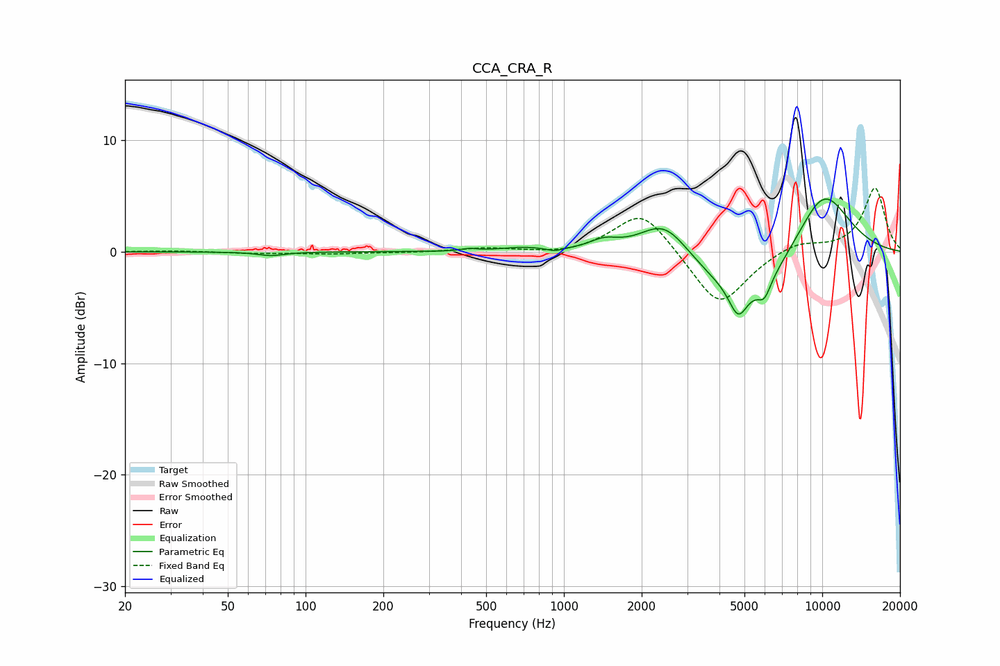

# CCA_CRA_R
See [usage instructions](https://github.com/jaakkopasanen/AutoEq#usage) for more options and info.

### Parametric EQs
Apply preamp of -4.8 dB when using parametric equalizer.

|   # | Type    |   Fc (Hz) |    Q |   Gain (dB) |
|-----|---------|-----------|------|-------------|
|   1 | Peaking |        73 | 2.78 |        -0.3 |
|   2 | Peaking |       430 | 4.94 |         0.2 |
|   3 | Peaking |       691 | 1.63 |         0.4 |
|   4 | Peaking |       921 | 4.96 |        -0.3 |
|   5 | Peaking |      1429 | 2.43 |         0.9 |
|   6 | Peaking |      2448 | 1.44 |         3.5 |
|   7 | Peaking |      4728 | 3.98 |        -2.7 |
|   8 | Peaking |      5254 | 0.7  |        -4.7 |
|   9 | Peaking |      5968 | 5.17 |        -1.6 |
|  10 | Peaking |     10000 | 1.05 |         6.5 |

### Fixed Band EQs
When using fixed band (also called graphic) equalizer, apply preamp of **-5.8 dB** (if available) and set gains manually with these parameters.

|   # | Type    |   Fc (Hz) |    Q |   Gain (dB) |
|-----|---------|-----------|------|-------------|
|   1 | Peaking |        31 | 1.41 |         0.1 |
|   2 | Peaking |        62 | 1.41 |        -0.1 |
|   3 | Peaking |       125 | 1.41 |        -0.2 |
|   4 | Peaking |       250 | 1.41 |        -0.1 |
|   5 | Peaking |       500 | 1.41 |         0.3 |
|   6 | Peaking |      1000 | 1.41 |        -0.3 |
|   7 | Peaking |      2000 | 1.41 |         3.9 |
|   8 | Peaking |      4000 | 1.41 |        -5.1 |
|   9 | Peaking |      8000 | 1.41 |         0.9 |
|  10 | Peaking |     16000 | 1.41 |         5.7 |

### Graphs

