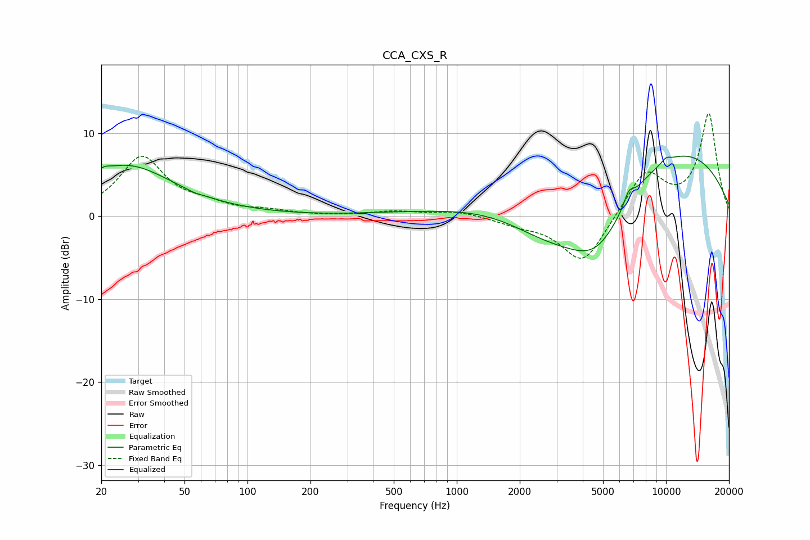

# CCA_CXS_R
See [usage instructions](https://github.com/jaakkopasanen/AutoEq#usage) for more options and info.

### Parametric EQs
Apply preamp of -7.3 dB when using parametric equalizer.

|   # | Type    |   Fc (Hz) |    Q |   Gain (dB) |
|-----|---------|-----------|------|-------------|
|   1 | Peaking |        21 | 5.46 |         0.4 |
|   2 | Peaking |        24 | 0.4  |         1.5 |
|   3 | Peaking |        27 | 0.7  |         4.5 |
|   4 | Peaking |        56 | 4.95 |        -0.2 |
|   5 | Peaking |       435 | 1.18 |         0.1 |
|   6 | Peaking |      2691 | 0.62 |        -5.4 |
|   7 | Peaking |      4675 | 0.73 |       -11.1 |
|   8 | Peaking |      6639 | 5.91 |         1.5 |
|   9 | Peaking |      6916 | 0.23 |        11.5 |
|  10 | Peaking |     10000 | 6    |         0.5 |

### Fixed Band EQs
When using fixed band (also called graphic) equalizer, apply preamp of **-12.4 dB** (if available) and set gains manually with these parameters.

|   # | Type    |   Fc (Hz) |    Q |   Gain (dB) |
|-----|---------|-----------|------|-------------|
|   1 | Peaking |        31 | 1.41 |         7   |
|   2 | Peaking |        62 | 1.41 |         1   |
|   3 | Peaking |       125 | 1.41 |         0.5 |
|   4 | Peaking |       250 | 1.41 |        -0   |
|   5 | Peaking |       500 | 1.41 |         0.5 |
|   6 | Peaking |      1000 | 1.41 |         0.6 |
|   7 | Peaking |      2000 | 1.41 |        -0.8 |
|   8 | Peaking |      4000 | 1.41 |        -5.9 |
|   9 | Peaking |      8000 | 1.41 |         5.3 |
|  10 | Peaking |     16000 | 1.41 |        12.2 |

### Graphs

