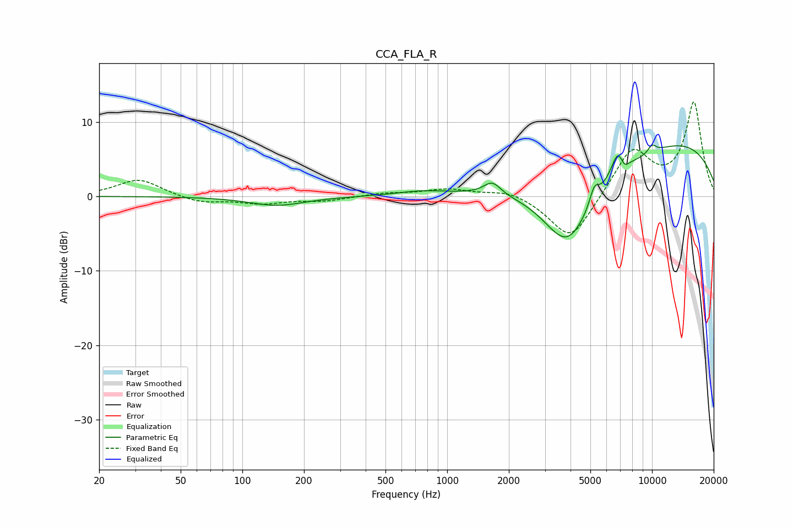

# CCA_FLA_R
See [usage instructions](https://github.com/jaakkopasanen/AutoEq#usage) for more options and info.

### Parametric EQs
Apply preamp of -7.0 dB when using parametric equalizer.

|   # | Type    |   Fc (Hz) |    Q |   Gain (dB) |
|-----|---------|-----------|------|-------------|
|   1 | Peaking |       148 | 1.05 |        -1.2 |
|   2 | Peaking |       750 | 1.2  |         0.6 |
|   3 | Peaking |      1659 | 3.52 |         1.7 |
|   4 | Peaking |      3855 | 1.07 |       -10   |
|   5 | Peaking |      5224 | 6    |         2.3 |
|   6 | Peaking |      6401 | 0.55 |        -2.4 |
|   7 | Peaking |      6859 | 3.79 |         4   |
|   8 | Peaking |      7288 | 5.85 |        -1.7 |
|   9 | Peaking |      9889 | 0.23 |         8.5 |
|  10 | Peaking |     10000 | 5.92 |         1.1 |

### Fixed Band EQs
When using fixed band (also called graphic) equalizer, apply preamp of **-12.8 dB** (if available) and set gains manually with these parameters.

|   # | Type    |   Fc (Hz) |    Q |   Gain (dB) |
|-----|---------|-----------|------|-------------|
|   1 | Peaking |        31 | 1.41 |         2.3 |
|   2 | Peaking |        62 | 1.41 |        -0.9 |
|   3 | Peaking |       125 | 1.41 |        -0.9 |
|   4 | Peaking |       250 | 1.41 |        -0.6 |
|   5 | Peaking |       500 | 1.41 |         0.4 |
|   6 | Peaking |      1000 | 1.41 |         0.9 |
|   7 | Peaking |      2000 | 1.41 |         0.9 |
|   8 | Peaking |      4000 | 1.41 |        -6.2 |
|   9 | Peaking |      8000 | 1.41 |         6.3 |
|  10 | Peaking |     16000 | 1.41 |        12.5 |

### Graphs

