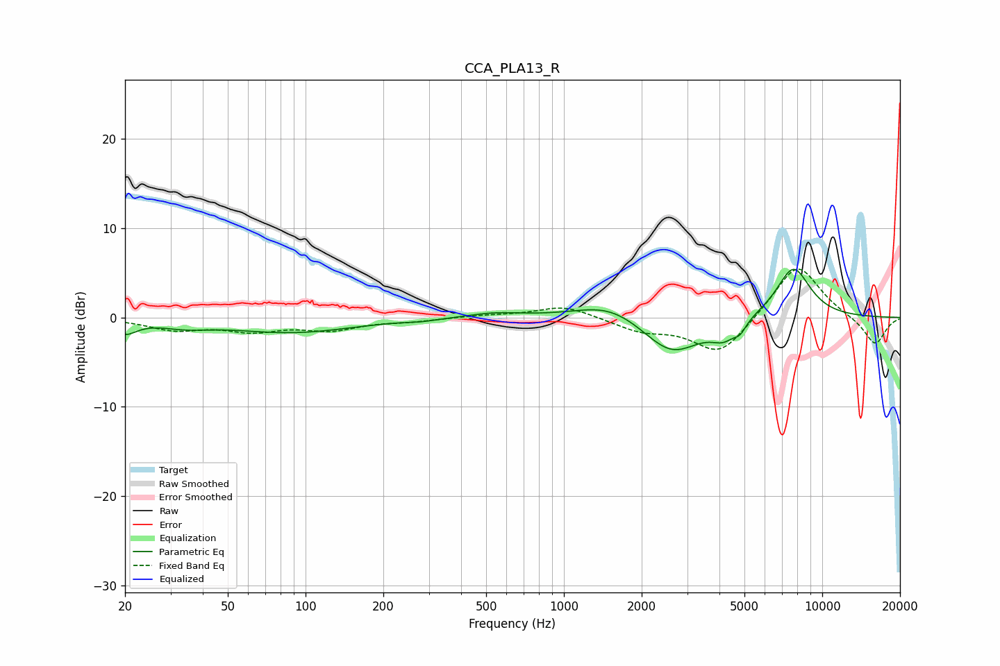

# CCA_PLA13_R
See [usage instructions](https://github.com/jaakkopasanen/AutoEq#usage) for more options and info.

### Parametric EQs
Apply preamp of -5.5 dB when using parametric equalizer.

|   # | Type    |   Fc (Hz) |    Q |   Gain (dB) |
|-----|---------|-----------|------|-------------|
|   1 | Peaking |        20 | 3.2  |        -1.5 |
|   2 | Peaking |        34 | 1.46 |        -0.7 |
|   3 | Peaking |        89 | 0.59 |        -1.6 |
|   4 | Peaking |       282 | 2.78 |        -0.2 |
|   5 | Peaking |       540 | 1.36 |         0.5 |
|   6 | Peaking |      1509 | 1.07 |         1.9 |
|   7 | Peaking |      2615 | 1.25 |        -4.3 |
|   8 | Peaking |      4162 | 2.94 |        -1.7 |
|   9 | Peaking |      4810 | 6    |        -1   |
|  10 | Peaking |      7727 | 1.98 |         5.7 |

### Fixed Band EQs
When using fixed band (also called graphic) equalizer, apply preamp of **-5.5 dB** (if available) and set gains manually with these parameters.

|   # | Type    |   Fc (Hz) |    Q |   Gain (dB) |
|-----|---------|-----------|------|-------------|
|   1 | Peaking |        31 | 1.41 |        -1.3 |
|   2 | Peaking |        62 | 1.41 |        -1.3 |
|   3 | Peaking |       125 | 1.41 |        -1.2 |
|   4 | Peaking |       250 | 1.41 |        -0.4 |
|   5 | Peaking |       500 | 1.41 |         0.2 |
|   6 | Peaking |      1000 | 1.41 |         1.4 |
|   7 | Peaking |      2000 | 1.41 |        -1.4 |
|   8 | Peaking |      4000 | 1.41 |        -4.2 |
|   9 | Peaking |      8000 | 1.41 |         6.2 |
|  10 | Peaking |     16000 | 1.41 |        -3.2 |

### Graphs

