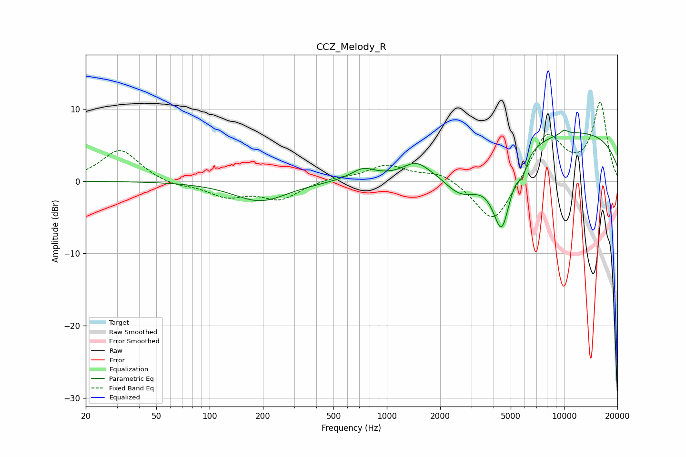

# CCZ_Melody_R
See [usage instructions](https://github.com/jaakkopasanen/AutoEq#usage) for more options and info.

### Parametric EQs
Apply preamp of -7.1 dB when using parametric equalizer.

|   # | Type    |   Fc (Hz) |    Q |   Gain (dB) |
|-----|---------|-----------|------|-------------|
|   1 | Peaking |       193 | 0.93 |        -2.8 |
|   2 | Peaking |       734 | 2.04 |         1.5 |
|   3 | Peaking |      1472 | 1.87 |         2.2 |
|   4 | Peaking |      1990 | 2.11 |         0.6 |
|   5 | Peaking |      2654 | 1.07 |        -5.1 |
|   6 | Peaking |      4285 | 5.29 |         0.4 |
|   7 | Peaking |      4433 | 2.68 |       -10.3 |
|   8 | Peaking |      5821 | 6    |        -2   |
|   9 | Peaking |     10000 | 0.21 |         7.1 |
|  10 | Peaking |     10000 | 6    |         0.6 |

### Fixed Band EQs
When using fixed band (also called graphic) equalizer, apply preamp of **-11.0 dB** (if available) and set gains manually with these parameters.

|   # | Type    |   Fc (Hz) |    Q |   Gain (dB) |
|-----|---------|-----------|------|-------------|
|   1 | Peaking |        31 | 1.41 |         4.4 |
|   2 | Peaking |        62 | 1.41 |        -0.7 |
|   3 | Peaking |       125 | 1.41 |        -2   |
|   4 | Peaking |       250 | 1.41 |        -2.4 |
|   5 | Peaking |       500 | 1.41 |         0.5 |
|   6 | Peaking |      1000 | 1.41 |         2.1 |
|   7 | Peaking |      2000 | 1.41 |         1.3 |
|   8 | Peaking |      4000 | 1.41 |        -6.3 |
|   9 | Peaking |      8000 | 1.41 |         6.7 |
|  10 | Peaking |     16000 | 1.41 |        10.7 |

### Graphs

