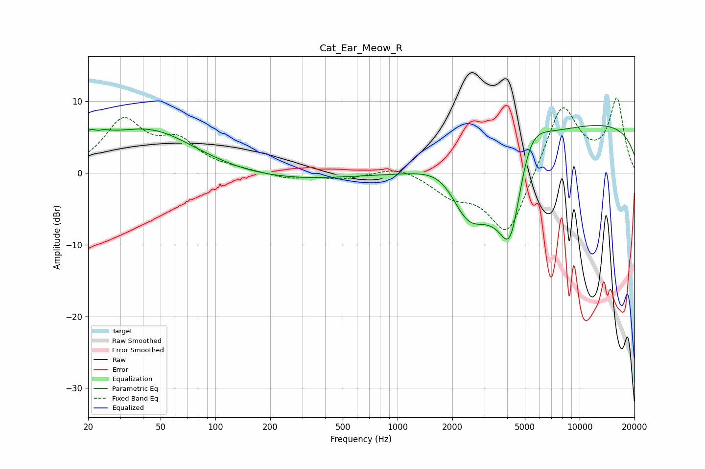

# Cat_Ear_Meow_R
See [usage instructions](https://github.com/jaakkopasanen/AutoEq#usage) for more options and info.

### Parametric EQs
Apply preamp of -6.7 dB when using parametric equalizer.

|   # | Type    |   Fc (Hz) |    Q |   Gain (dB) |
|-----|---------|-----------|------|-------------|
|   1 | Peaking |        21 | 2.36 |         3.3 |
|   2 | Peaking |        22 | 5.63 |         1.3 |
|   3 | Peaking |        22 | 5.13 |        -2.4 |
|   4 | Peaking |        44 | 0.51 |         6.8 |
|   5 | Peaking |       131 | 0.26 |        -1.5 |
|   6 | Peaking |      1894 | 0.99 |         5.3 |
|   7 | Peaking |      2395 | 0.99 |       -11.3 |
|   8 | Peaking |      4169 | 1.51 |       -16.8 |
|   9 | Peaking |      5263 | 1.37 |         8.5 |
|  10 | Peaking |     10000 | 0.18 |         7.2 |

### Fixed Band EQs
When using fixed band (also called graphic) equalizer, apply preamp of **-10.6 dB** (if available) and set gains manually with these parameters.

|   # | Type    |   Fc (Hz) |    Q |   Gain (dB) |
|-----|---------|-----------|------|-------------|
|   1 | Peaking |        31 | 1.41 |         7   |
|   2 | Peaking |        62 | 1.41 |         3.9 |
|   3 | Peaking |       125 | 1.41 |         0.3 |
|   4 | Peaking |       250 | 1.41 |        -0.8 |
|   5 | Peaking |       500 | 1.41 |        -0.8 |
|   6 | Peaking |      1000 | 1.41 |         1.1 |
|   7 | Peaking |      2000 | 1.41 |        -2.6 |
|   8 | Peaking |      4000 | 1.41 |        -9.1 |
|   9 | Peaking |      8000 | 1.41 |         9.9 |
|  10 | Peaking |     16000 | 1.41 |        10   |

### Graphs

