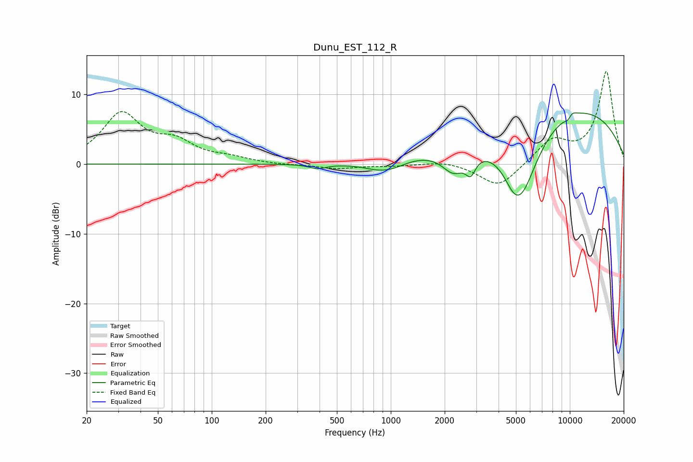

# Dunu_EST_112_R
See [usage instructions](https://github.com/jaakkopasanen/AutoEq#usage) for more options and info.

### Parametric EQs
Apply preamp of -7.4 dB when using parametric equalizer.

|   # | Type    |   Fc (Hz) |    Q |   Gain (dB) |
|-----|---------|-----------|------|-------------|
|   1 | Peaking |       391 | 3    |        -0.6 |
|   2 | Peaking |       909 | 1.41 |        -1.5 |
|   3 | Peaking |      1087 | 2.91 |        -0.2 |
|   4 | Peaking |      2244 | 2.13 |        -3.4 |
|   5 | Peaking |      2795 | 5.05 |        -2.5 |
|   6 | Peaking |      4790 | 3.5  |        -0.9 |
|   7 | Peaking |      5313 | 1.3  |       -11.7 |
|   8 | Peaking |      8564 | 0.25 |         9.1 |
|   9 | Peaking |      9881 | 5.17 |        -2.7 |
|  10 | Peaking |     10000 | 4.6  |         2.7 |

### Fixed Band EQs
When using fixed band (also called graphic) equalizer, apply preamp of **-13.4 dB** (if available) and set gains manually with these parameters.

|   # | Type    |   Fc (Hz) |    Q |   Gain (dB) |
|-----|---------|-----------|------|-------------|
|   1 | Peaking |        31 | 1.41 |         7   |
|   2 | Peaking |        62 | 1.41 |         2.6 |
|   3 | Peaking |       125 | 1.41 |         0.7 |
|   4 | Peaking |       250 | 1.41 |        -0.1 |
|   5 | Peaking |       500 | 1.41 |        -0.6 |
|   6 | Peaking |      1000 | 1.41 |        -0.2 |
|   7 | Peaking |      2000 | 1.41 |         0.5 |
|   8 | Peaking |      4000 | 1.41 |        -3.4 |
|   9 | Peaking |      8000 | 1.41 |         3.3 |
|  10 | Peaking |     16000 | 1.41 |        13.3 |

### Graphs

