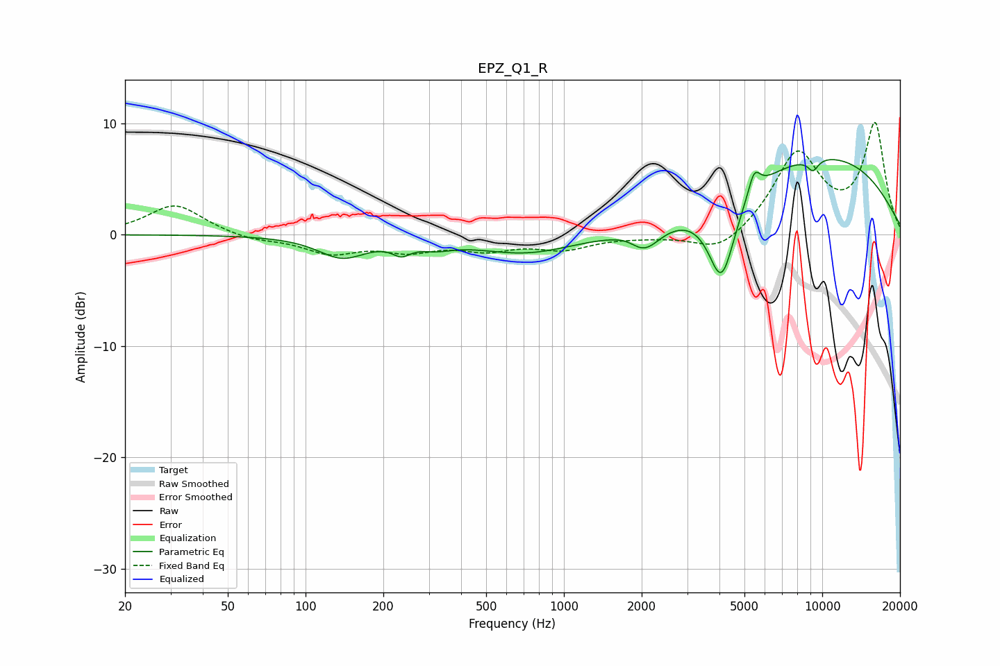

# EPZ_Q1_R
See [usage instructions](https://github.com/jaakkopasanen/AutoEq#usage) for more options and info.

### Parametric EQs
Apply preamp of -6.8 dB when using parametric equalizer.

|   # | Type    |   Fc (Hz) |    Q |   Gain (dB) |
|-----|---------|-----------|------|-------------|
|   1 | Peaking |       138 | 1.53 |        -1.9 |
|   2 | Peaking |       235 | 4.07 |        -1   |
|   3 | Peaking |       320 | 2.15 |        -0.6 |
|   4 | Peaking |       721 | 0.72 |        -1.7 |
|   5 | Peaking |      1774 | 2.86 |         0.4 |
|   6 | Peaking |      2045 | 2.23 |        -2.2 |
|   7 | Peaking |      4079 | 2.67 |        -7.5 |
|   8 | Peaking |      5452 | 5.89 |         2.1 |
|   9 | Peaking |      9212 | 5.96 |        -1.1 |
|  10 | Peaking |      9812 | 0.33 |         7.1 |

### Fixed Band EQs
When using fixed band (also called graphic) equalizer, apply preamp of **-10.2 dB** (if available) and set gains manually with these parameters.

|   # | Type    |   Fc (Hz) |    Q |   Gain (dB) |
|-----|---------|-----------|------|-------------|
|   1 | Peaking |        31 | 1.41 |         2.7 |
|   2 | Peaking |        62 | 1.41 |        -0.5 |
|   3 | Peaking |       125 | 1.41 |        -1.5 |
|   4 | Peaking |       250 | 1.41 |        -1.2 |
|   5 | Peaking |       500 | 1.41 |        -1.1 |
|   6 | Peaking |      1000 | 1.41 |        -1.2 |
|   7 | Peaking |      2000 | 1.41 |        -0.1 |
|   8 | Peaking |      4000 | 1.41 |        -1.8 |
|   9 | Peaking |      8000 | 1.41 |         7.2 |
|  10 | Peaking |     16000 | 1.41 |         9.8 |

### Graphs

