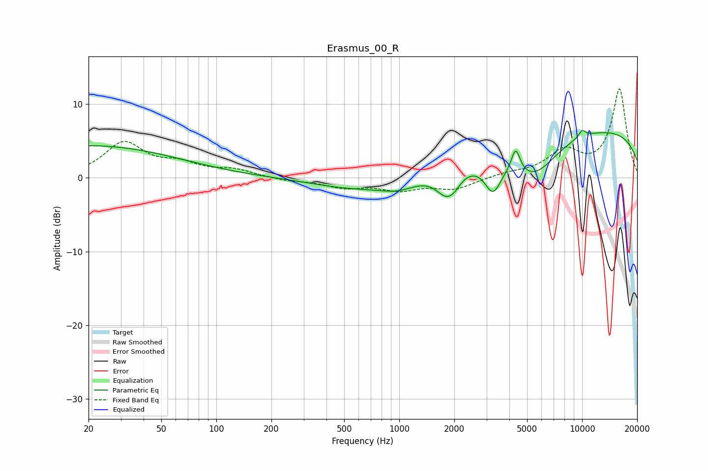

# Erasmus_00_R
See [usage instructions](https://github.com/jaakkopasanen/AutoEq#usage) for more options and info.

### Parametric EQs
Apply preamp of -6.5 dB when using parametric equalizer.

|   # | Type    |   Fc (Hz) |    Q |   Gain (dB) |
|-----|---------|-----------|------|-------------|
|   1 | Peaking |        20 | 0.28 |         4.4 |
|   2 | Peaking |       573 | 0.61 |        -1.5 |
|   3 | Peaking |       994 | 1.31 |        -1.5 |
|   4 | Peaking |      1825 | 2.36 |        -3.6 |
|   5 | Peaking |      2020 | 4.41 |        -0.6 |
|   6 | Peaking |      3255 | 3.04 |        -4.2 |
|   7 | Peaking |      4334 | 5.92 |         3.2 |
|   8 | Peaking |      5434 | 1.06 |        -5.2 |
|   9 | Peaking |     10000 | 0.18 |         6.8 |
|  10 | Peaking |     10000 | 5.99 |         1   |

### Fixed Band EQs
When using fixed band (also called graphic) equalizer, apply preamp of **-12.1 dB** (if available) and set gains manually with these parameters.

|   # | Type    |   Fc (Hz) |    Q |   Gain (dB) |
|-----|---------|-----------|------|-------------|
|   1 | Peaking |        31 | 1.41 |         4.6 |
|   2 | Peaking |        62 | 1.41 |         1.6 |
|   3 | Peaking |       125 | 1.41 |         1   |
|   4 | Peaking |       250 | 1.41 |        -0.4 |
|   5 | Peaking |       500 | 1.41 |        -1.2 |
|   6 | Peaking |      1000 | 1.41 |        -1.5 |
|   7 | Peaking |      2000 | 1.41 |        -1.5 |
|   8 | Peaking |      4000 | 1.41 |         0.5 |
|   9 | Peaking |      8000 | 1.41 |         3.4 |
|  10 | Peaking |     16000 | 1.41 |        12   |

### Graphs

