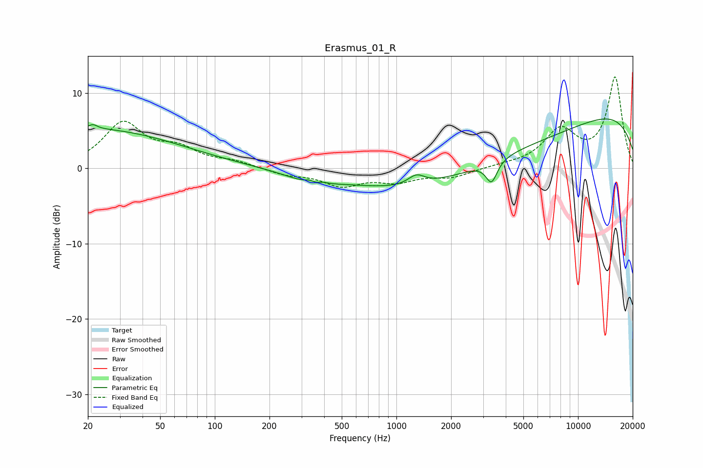

# Erasmus_01_R
See [usage instructions](https://github.com/jaakkopasanen/AutoEq#usage) for more options and info.

### Parametric EQs
Apply preamp of -6.7 dB when using parametric equalizer.

|   # | Type    |   Fc (Hz) |    Q |   Gain (dB) |
|-----|---------|-----------|------|-------------|
|   1 | Peaking |        20 | 0.28 |         5.2 |
|   2 | Peaking |        21 | 5.98 |         0.6 |
|   3 | Peaking |       331 | 5.98 |         0.3 |
|   4 | Peaking |       339 | 1.02 |        -1.2 |
|   5 | Peaking |       371 | 5.14 |        -0.3 |
|   6 | Peaking |       383 | 4.31 |         0.5 |
|   7 | Peaking |      1289 | 3.08 |         1.3 |
|   8 | Peaking |      2969 | 0.22 |        -5.7 |
|   9 | Peaking |      3341 | 4.63 |        -2.9 |
|  10 | Peaking |      9334 | 0.19 |         9   |

### Fixed Band EQs
When using fixed band (also called graphic) equalizer, apply preamp of **-12.2 dB** (if available) and set gains manually with these parameters.

|   # | Type    |   Fc (Hz) |    Q |   Gain (dB) |
|-----|---------|-----------|------|-------------|
|   1 | Peaking |        31 | 1.41 |         5.8 |
|   2 | Peaking |        62 | 1.41 |         2.2 |
|   3 | Peaking |       125 | 1.41 |         0.8 |
|   4 | Peaking |       250 | 1.41 |        -0.8 |
|   5 | Peaking |       500 | 1.41 |        -2.1 |
|   6 | Peaking |      1000 | 1.41 |        -1.5 |
|   7 | Peaking |      2000 | 1.41 |        -1.1 |
|   8 | Peaking |      4000 | 1.41 |         0.3 |
|   9 | Peaking |      8000 | 1.41 |         4.8 |
|  10 | Peaking |     16000 | 1.41 |        12   |

### Graphs

