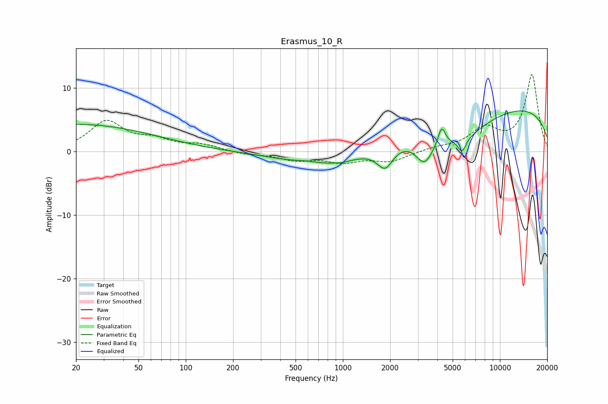

# Erasmus_10_R
See [usage instructions](https://github.com/jaakkopasanen/AutoEq#usage) for more options and info.

### Parametric EQs
Apply preamp of -6.5 dB when using parametric equalizer.

|   # | Type    |   Fc (Hz) |    Q |   Gain (dB) |
|-----|---------|-----------|------|-------------|
|   1 | Peaking |        20 | 0.28 |         4.3 |
|   2 | Peaking |       587 | 1.77 |         0.4 |
|   3 | Peaking |       842 | 0.52 |        -2.8 |
|   4 | Peaking |       985 | 4.26 |        -0.2 |
|   5 | Peaking |      1858 | 2.72 |        -3.5 |
|   6 | Peaking |      3305 | 2.52 |        -4   |
|   7 | Peaking |      4257 | 6    |         2.9 |
|   8 | Peaking |      5441 | 0.7  |        -4.5 |
|   9 | Peaking |      5742 | 5.24 |        -2.2 |
|  10 | Peaking |      9271 | 0.18 |         7.7 |

### Fixed Band EQs
When using fixed band (also called graphic) equalizer, apply preamp of **-12.2 dB** (if available) and set gains manually with these parameters.

|   # | Type    |   Fc (Hz) |    Q |   Gain (dB) |
|-----|---------|-----------|------|-------------|
|   1 | Peaking |        31 | 1.41 |         4.6 |
|   2 | Peaking |        62 | 1.41 |         1.5 |
|   3 | Peaking |       125 | 1.41 |         1   |
|   4 | Peaking |       250 | 1.41 |        -0.4 |
|   5 | Peaking |       500 | 1.41 |        -1.2 |
|   6 | Peaking |      1000 | 1.41 |        -1.5 |
|   7 | Peaking |      2000 | 1.41 |        -1.5 |
|   8 | Peaking |      4000 | 1.41 |         0.5 |
|   9 | Peaking |      8000 | 1.41 |         3.4 |
|  10 | Peaking |     16000 | 1.41 |        12   |

### Graphs

