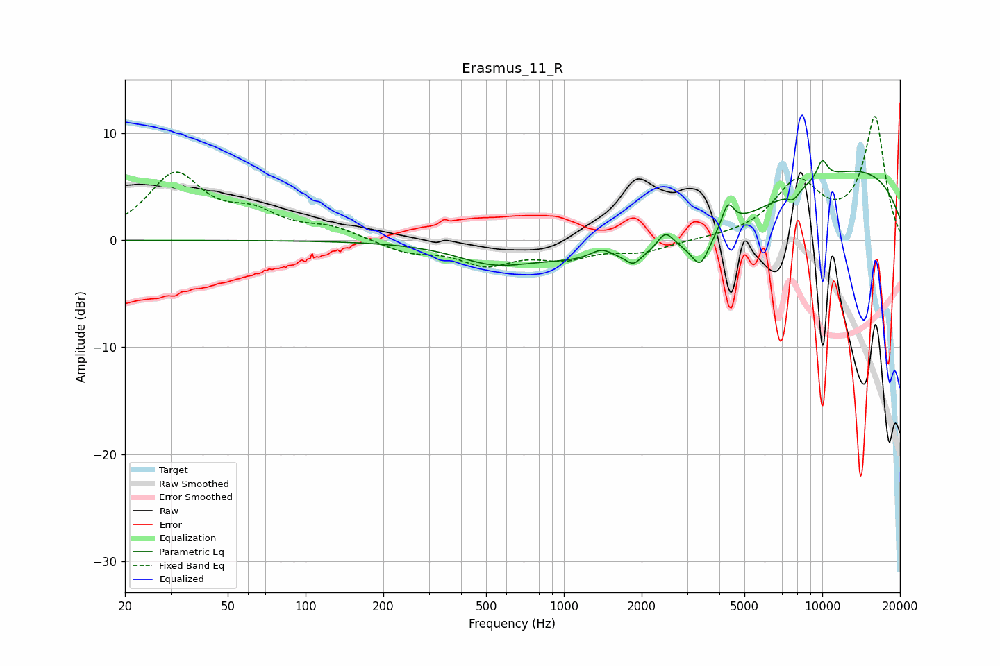

# Erasmus_11_R
See [usage instructions](https://github.com/jaakkopasanen/AutoEq#usage) for more options and info.

### Parametric EQs
Apply preamp of -7.6 dB when using parametric equalizer.

|   # | Type    |   Fc (Hz) |    Q |   Gain (dB) |
|-----|---------|-----------|------|-------------|
|   1 | Peaking |       530 | 1.01 |        -1.6 |
|   2 | Peaking |      1401 | 3.16 |         1   |
|   3 | Peaking |      1858 | 4.98 |        -0.9 |
|   4 | Peaking |      2471 | 4.44 |         1.7 |
|   5 | Peaking |      3290 | 0.31 |        -5.2 |
|   6 | Peaking |      3375 | 4.01 |        -2.8 |
|   7 | Peaking |      4309 | 6    |         2.3 |
|   8 | Peaking |      7738 | 6    |        -0.8 |
|   9 | Peaking |      9712 | 0.22 |         8.2 |
|  10 | Peaking |     10000 | 5.84 |         1.8 |

### Fixed Band EQs
When using fixed band (also called graphic) equalizer, apply preamp of **-11.7 dB** (if available) and set gains manually with these parameters.

|   # | Type    |   Fc (Hz) |    Q |   Gain (dB) |
|-----|---------|-----------|------|-------------|
|   1 | Peaking |        31 | 1.41 |         6   |
|   2 | Peaking |        62 | 1.41 |         2.1 |
|   3 | Peaking |       125 | 1.41 |         1.1 |
|   4 | Peaking |       250 | 1.41 |        -1.1 |
|   5 | Peaking |       500 | 1.41 |        -2.1 |
|   6 | Peaking |      1000 | 1.41 |        -1.4 |
|   7 | Peaking |      2000 | 1.41 |        -1   |
|   8 | Peaking |      4000 | 1.41 |         0.1 |
|   9 | Peaking |      8000 | 1.41 |         5.1 |
|  10 | Peaking |     16000 | 1.41 |        11.4 |

### Graphs

