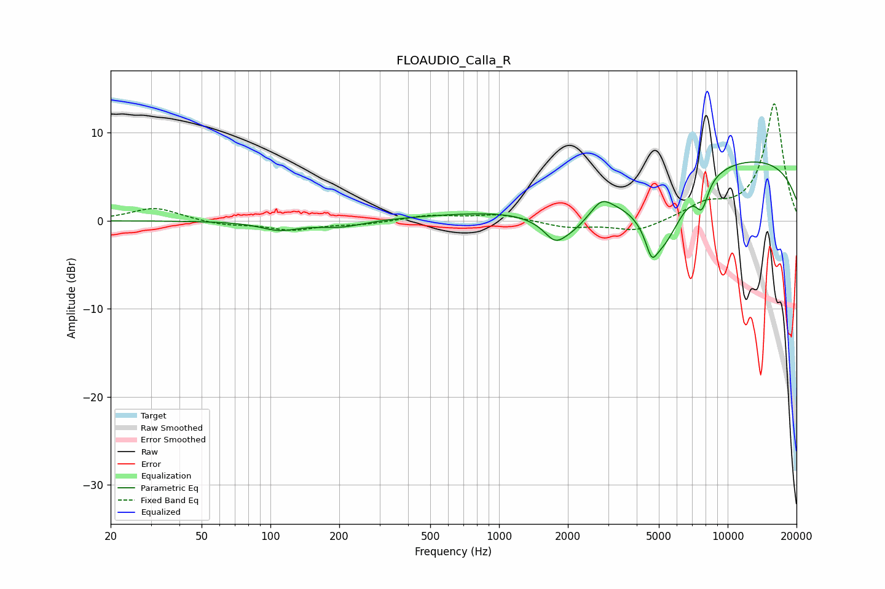

# FLOAUDIO_Calla_R
See [usage instructions](https://github.com/jaakkopasanen/AutoEq#usage) for more options and info.

### Parametric EQs
Apply preamp of -6.8 dB when using parametric equalizer.

|   # | Type    |   Fc (Hz) |    Q |   Gain (dB) |
|-----|---------|-----------|------|-------------|
|   1 | Peaking |       110 | 1.68 |        -1   |
|   2 | Peaking |       203 | 1.39 |        -0.7 |
|   3 | Peaking |       816 | 0.43 |         0.6 |
|   4 | Peaking |      1750 | 3.42 |        -1.4 |
|   5 | Peaking |      1993 | 1.26 |        -3.9 |
|   6 | Peaking |      2796 | 3.19 |         1.5 |
|   7 | Peaking |      4647 | 5.83 |        -2.4 |
|   8 | Peaking |      5142 | 1.44 |        -8.3 |
|   9 | Peaking |      7718 | 4.93 |        -2.9 |
|  10 | Peaking |     10000 | 0.19 |         7.4 |

### Fixed Band EQs
When using fixed band (also called graphic) equalizer, apply preamp of **-13.4 dB** (if available) and set gains manually with these parameters.

|   # | Type    |   Fc (Hz) |    Q |   Gain (dB) |
|-----|---------|-----------|------|-------------|
|   1 | Peaking |        31 | 1.41 |         1.5 |
|   2 | Peaking |        62 | 1.41 |        -0.5 |
|   3 | Peaking |       125 | 1.41 |        -1   |
|   4 | Peaking |       250 | 1.41 |        -0.4 |
|   5 | Peaking |       500 | 1.41 |         0.6 |
|   6 | Peaking |      1000 | 1.41 |         0.7 |
|   7 | Peaking |      2000 | 1.41 |        -0.7 |
|   8 | Peaking |      4000 | 1.41 |        -1.3 |
|   9 | Peaking |      8000 | 1.41 |         1.6 |
|  10 | Peaking |     16000 | 1.41 |        13.3 |

### Graphs

