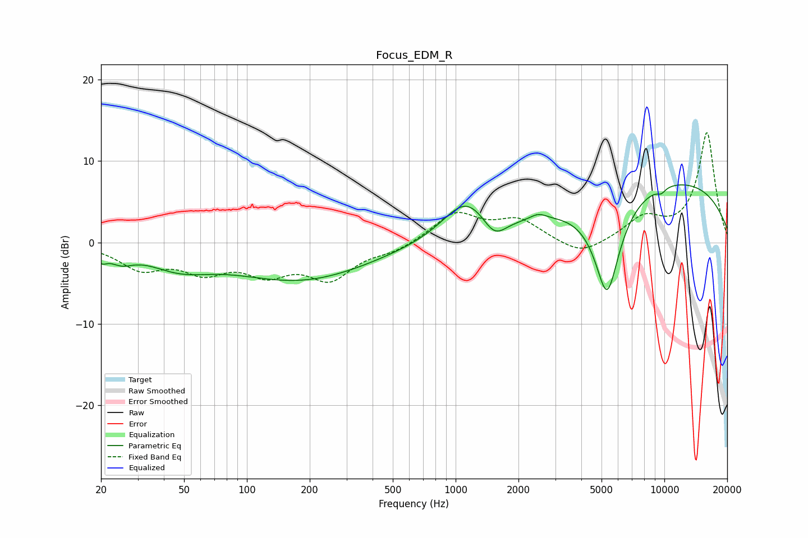

# Focus_EDM_R
See [usage instructions](https://github.com/jaakkopasanen/AutoEq#usage) for more options and info.

### Parametric EQs
Apply preamp of -7.2 dB when using parametric equalizer.

|   # | Type    |   Fc (Hz) |    Q |   Gain (dB) |
|-----|---------|-----------|------|-------------|
|   1 | Peaking |        20 | 5.58 |        -1.1 |
|   2 | Peaking |        25 | 2.48 |        -1.4 |
|   3 | Peaking |        47 | 0.93 |        -2.3 |
|   4 | Peaking |       181 | 0.43 |        -4.5 |
|   5 | Peaking |      1124 | 1.26 |         4.9 |
|   6 | Peaking |      1533 | 2.44 |        -2.6 |
|   7 | Peaking |      2490 | 3.68 |         0.7 |
|   8 | Peaking |      5317 | 2.18 |       -12.4 |
|   9 | Peaking |      9662 | 5.91 |        -0.6 |
|  10 | Peaking |     10000 | 0.25 |         7.8 |

### Fixed Band EQs
When using fixed band (also called graphic) equalizer, apply preamp of **-13.6 dB** (if available) and set gains manually with these parameters.

|   # | Type    |   Fc (Hz) |    Q |   Gain (dB) |
|-----|---------|-----------|------|-------------|
|   1 | Peaking |        31 | 1.41 |        -2.9 |
|   2 | Peaking |        62 | 1.41 |        -3   |
|   3 | Peaking |       125 | 1.41 |        -3.2 |
|   4 | Peaking |       250 | 1.41 |        -4.1 |
|   5 | Peaking |       500 | 1.41 |        -1   |
|   6 | Peaking |      1000 | 1.41 |         3.6 |
|   7 | Peaking |      2000 | 1.41 |         2.6 |
|   8 | Peaking |      4000 | 1.41 |        -1.8 |
|   9 | Peaking |      8000 | 1.41 |         2.7 |
|  10 | Peaking |     16000 | 1.41 |        13.5 |

### Graphs

