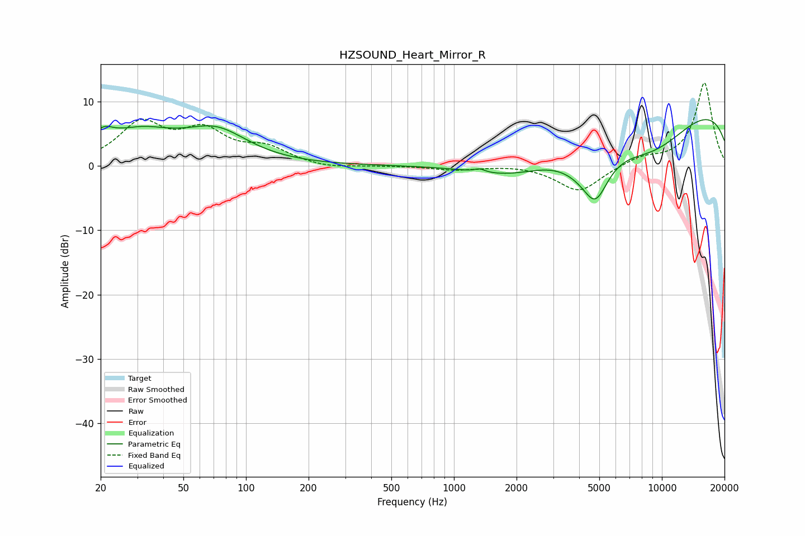

# HZSOUND_Heart_Mirror_R
See [usage instructions](https://github.com/jaakkopasanen/AutoEq#usage) for more options and info.

### Parametric EQs
Apply preamp of -7.3 dB when using parametric equalizer.

|   # | Type    |   Fc (Hz) |    Q |   Gain (dB) |
|-----|---------|-----------|------|-------------|
|   1 | Peaking |        20 | 3.13 |         2.1 |
|   2 | Peaking |        27 | 2.59 |        -0.2 |
|   3 | Peaking |        30 | 0.82 |         4.8 |
|   4 | Peaking |        72 | 0.92 |         4.8 |
|   5 | Peaking |      1331 | 5.85 |         0.5 |
|   6 | Peaking |      1956 | 0.62 |        -4.9 |
|   7 | Peaking |      4300 | 1.12 |        -3.7 |
|   8 | Peaking |      4797 | 2.37 |        -5.6 |
|   9 | Peaking |      8915 | 0.52 |        -9.6 |
|  10 | Peaking |      9708 | 0.19 |        13.4 |

### Fixed Band EQs
When using fixed band (also called graphic) equalizer, apply preamp of **-13.0 dB** (if available) and set gains manually with these parameters.

|   # | Type    |   Fc (Hz) |    Q |   Gain (dB) |
|-----|---------|-----------|------|-------------|
|   1 | Peaking |        31 | 1.41 |         6.2 |
|   2 | Peaking |        62 | 1.41 |         4.8 |
|   3 | Peaking |       125 | 1.41 |         2.4 |
|   4 | Peaking |       250 | 1.41 |        -0.5 |
|   5 | Peaking |       500 | 1.41 |        -0   |
|   6 | Peaking |      1000 | 1.41 |        -0.6 |
|   7 | Peaking |      2000 | 1.41 |         0.2 |
|   8 | Peaking |      4000 | 1.41 |        -4.1 |
|   9 | Peaking |      8000 | 1.41 |         1.2 |
|  10 | Peaking |     16000 | 1.41 |        12.9 |

### Graphs

