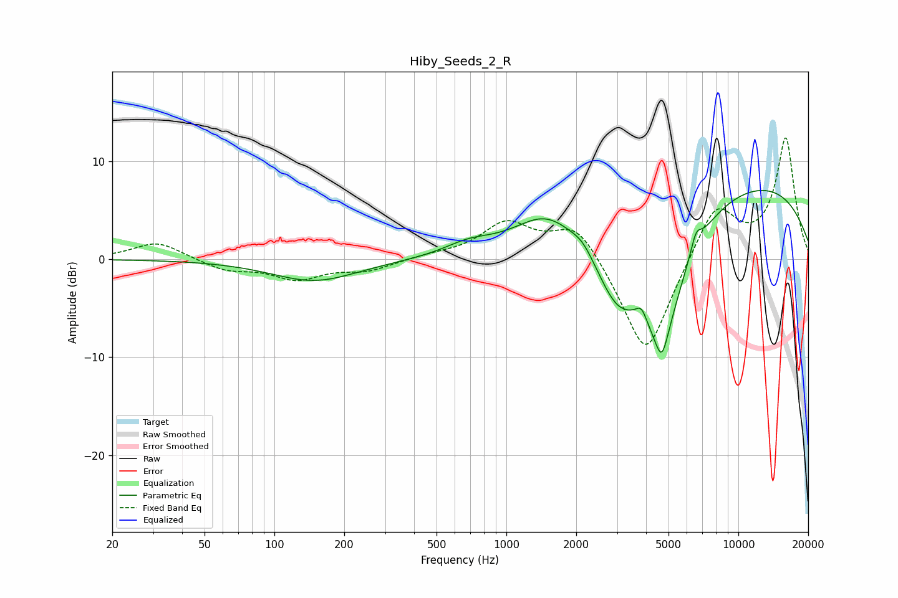

# Hiby_Seeds_2_R
See [usage instructions](https://github.com/jaakkopasanen/AutoEq#usage) for more options and info.

### Parametric EQs
Apply preamp of -7.1 dB when using parametric equalizer.

|   # | Type    |   Fc (Hz) |    Q |   Gain (dB) |
|-----|---------|-----------|------|-------------|
|   1 | Peaking |       149 | 0.76 |        -2.2 |
|   2 | Peaking |       688 | 1.33 |         1.2 |
|   3 | Peaking |      1490 | 1.01 |         3.9 |
|   4 | Peaking |      2135 | 3.12 |         0.9 |
|   5 | Peaking |      2988 | 1.52 |        -5.4 |
|   6 | Peaking |      3824 | 5.99 |         1.4 |
|   7 | Peaking |      4677 | 5.94 |        -2.3 |
|   8 | Peaking |      4681 | 1.31 |       -12.5 |
|   9 | Peaking |      6568 | 6    |         1.8 |
|  10 | Peaking |     10000 | 0.25 |         8.2 |

### Fixed Band EQs
When using fixed band (also called graphic) equalizer, apply preamp of **-12.5 dB** (if available) and set gains manually with these parameters.

|   # | Type    |   Fc (Hz) |    Q |   Gain (dB) |
|-----|---------|-----------|------|-------------|
|   1 | Peaking |        31 | 1.41 |         1.8 |
|   2 | Peaking |        62 | 1.41 |        -1.1 |
|   3 | Peaking |       125 | 1.41 |        -1.9 |
|   4 | Peaking |       250 | 1.41 |        -1.1 |
|   5 | Peaking |       500 | 1.41 |         0.4 |
|   6 | Peaking |      1000 | 1.41 |         3.6 |
|   7 | Peaking |      2000 | 1.41 |         3.9 |
|   8 | Peaking |      4000 | 1.41 |       -10.5 |
|   9 | Peaking |      8000 | 1.41 |         5.8 |
|  10 | Peaking |     16000 | 1.41 |        12.3 |

### Graphs

