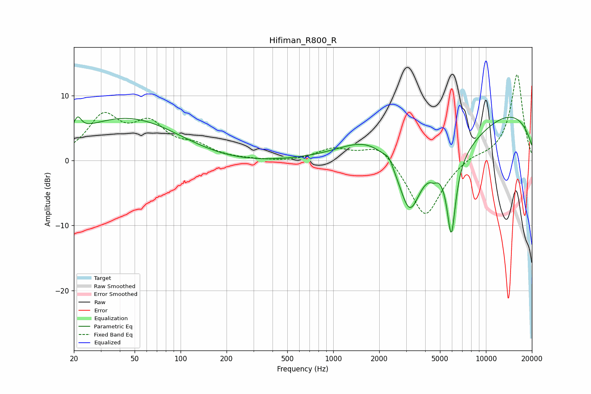

# Hifiman_R800_R
See [usage instructions](https://github.com/jaakkopasanen/AutoEq#usage) for more options and info.

### Parametric EQs
Apply preamp of -6.8 dB when using parametric equalizer.

|   # | Type    |   Fc (Hz) |    Q |   Gain (dB) |
|-----|---------|-----------|------|-------------|
|   1 | Peaking |        21 | 5.83 |         2.1 |
|   2 | Peaking |        46 | 0.38 |         6.8 |
|   3 | Peaking |       169 | 0.44 |        -1.1 |
|   4 | Peaking |      1661 | 0.8  |         2.4 |
|   5 | Peaking |      2313 | 5.48 |         1   |
|   6 | Peaking |      3160 | 1.78 |       -10.4 |
|   7 | Peaking |      4550 | 5.73 |        -0.9 |
|   8 | Peaking |      5931 | 4.53 |       -12.4 |
|   9 | Peaking |      6290 | 0.57 |        -5.6 |
|  10 | Peaking |     10000 | 0.23 |         9.1 |

### Fixed Band EQs
When using fixed band (also called graphic) equalizer, apply preamp of **-13.3 dB** (if available) and set gains manually with these parameters.

|   # | Type    |   Fc (Hz) |    Q |   Gain (dB) |
|-----|---------|-----------|------|-------------|
|   1 | Peaking |        31 | 1.41 |         6.4 |
|   2 | Peaking |        62 | 1.41 |         4.9 |
|   3 | Peaking |       125 | 1.41 |         1.8 |
|   4 | Peaking |       250 | 1.41 |         0   |
|   5 | Peaking |       500 | 1.41 |        -0.3 |
|   6 | Peaking |      1000 | 1.41 |         1.8 |
|   7 | Peaking |      2000 | 1.41 |         2.8 |
|   8 | Peaking |      4000 | 1.41 |        -9   |
|   9 | Peaking |      8000 | 1.41 |         0.8 |
|  10 | Peaking |     16000 | 1.41 |        13.4 |

### Graphs

