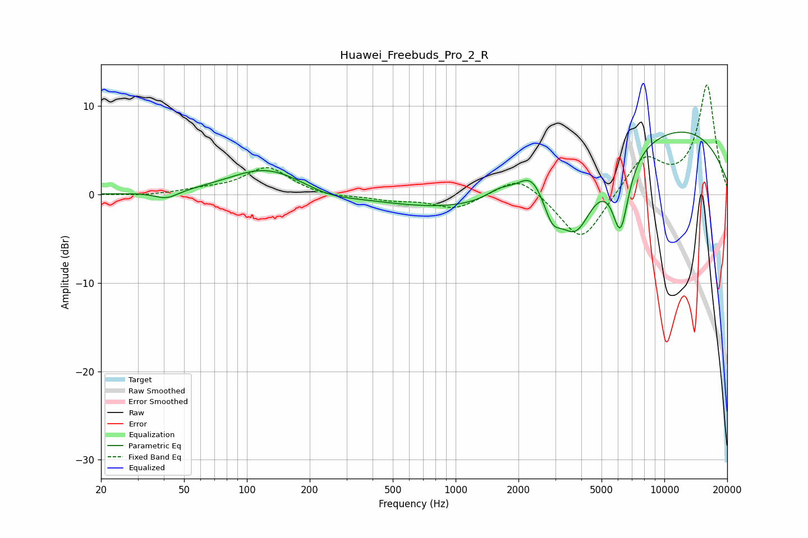

# Huawei_Freebuds_Pro_2_R
See [usage instructions](https://github.com/jaakkopasanen/AutoEq#usage) for more options and info.

### Parametric EQs
Apply preamp of -7.1 dB when using parametric equalizer.

|   # | Type    |   Fc (Hz) |    Q |   Gain (dB) |
|-----|---------|-----------|------|-------------|
|   1 | Peaking |        41 | 2.49 |        -0.9 |
|   2 | Peaking |       124 | 0.78 |         3   |
|   3 | Peaking |       248 | 1.21 |        -0.7 |
|   4 | Peaking |      1625 | 2.14 |         1.1 |
|   5 | Peaking |      2318 | 2.19 |         2.8 |
|   6 | Peaking |      2341 | 0.21 |        -2.6 |
|   7 | Peaking |      2902 | 3.27 |        -3   |
|   8 | Peaking |      3771 | 1.68 |        -6.7 |
|   9 | Peaking |      6163 | 3.38 |        -8.1 |
|  10 | Peaking |      9411 | 0.26 |         8.7 |

### Fixed Band EQs
When using fixed band (also called graphic) equalizer, apply preamp of **-12.5 dB** (if available) and set gains manually with these parameters.

|   # | Type    |   Fc (Hz) |    Q |   Gain (dB) |
|-----|---------|-----------|------|-------------|
|   1 | Peaking |        31 | 1.41 |        -0.2 |
|   2 | Peaking |        62 | 1.41 |         0.4 |
|   3 | Peaking |       125 | 1.41 |         3   |
|   4 | Peaking |       250 | 1.41 |        -0.4 |
|   5 | Peaking |       500 | 1.41 |        -0.6 |
|   6 | Peaking |      1000 | 1.41 |        -1.6 |
|   7 | Peaking |      2000 | 1.41 |         2.4 |
|   8 | Peaking |      4000 | 1.41 |        -5.6 |
|   9 | Peaking |      8000 | 1.41 |         4.2 |
|  10 | Peaking |     16000 | 1.41 |        12.3 |

### Graphs

