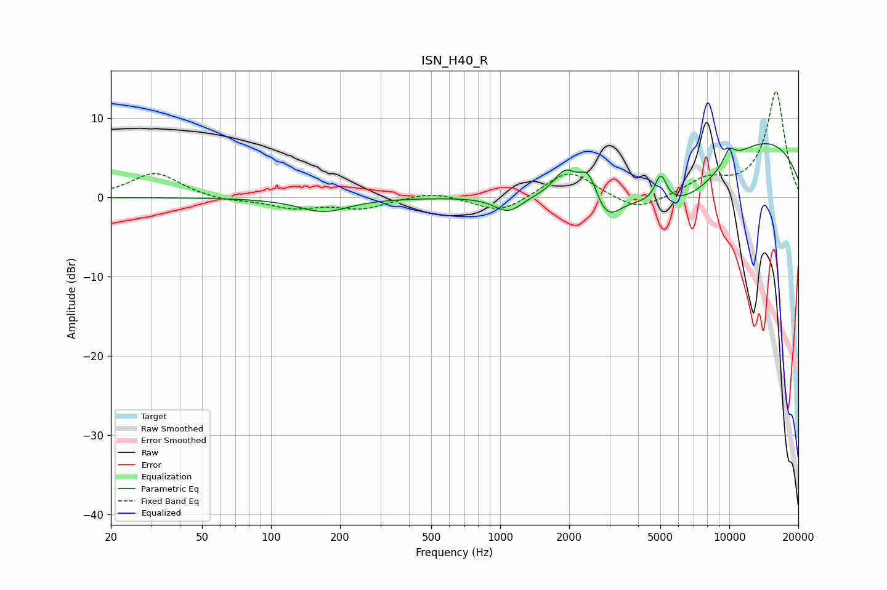

# ISN_H40_R
See [usage instructions](https://github.com/jaakkopasanen/AutoEq#usage) for more options and info.

### Parametric EQs
Apply preamp of -6.9 dB when using parametric equalizer.

|   # | Type    |   Fc (Hz) |    Q |   Gain (dB) |
|-----|---------|-----------|------|-------------|
|   1 | Peaking |       170 | 1.31 |        -1.8 |
|   2 | Peaking |      1085 | 2.36 |        -2   |
|   3 | Peaking |      1917 | 2.9  |         3.1 |
|   4 | Peaking |      2436 | 3.42 |         4   |
|   5 | Peaking |      2716 | 2.16 |        -1.5 |
|   6 | Peaking |      2951 | 2.57 |        -2.3 |
|   7 | Peaking |      5021 | 5.47 |         3.5 |
|   8 | Peaking |      6388 | 0.49 |       -10.6 |
|   9 | Peaking |      9987 | 0.27 |        12   |
|  10 | Peaking |     10000 | 4.72 |         1.8 |

### Fixed Band EQs
When using fixed band (also called graphic) equalizer, apply preamp of **-13.5 dB** (if available) and set gains manually with these parameters.

|   # | Type    |   Fc (Hz) |    Q |   Gain (dB) |
|-----|---------|-----------|------|-------------|
|   1 | Peaking |        31 | 1.41 |         3.2 |
|   2 | Peaking |        62 | 1.41 |        -0.5 |
|   3 | Peaking |       125 | 1.41 |        -1.2 |
|   4 | Peaking |       250 | 1.41 |        -1.3 |
|   5 | Peaking |       500 | 1.41 |         0.8 |
|   6 | Peaking |      1000 | 1.41 |        -2   |
|   7 | Peaking |      2000 | 1.41 |         3.5 |
|   8 | Peaking |      4000 | 1.41 |        -1.9 |
|   9 | Peaking |      8000 | 1.41 |         2   |
|  10 | Peaking |     16000 | 1.41 |        13.4 |

### Graphs

