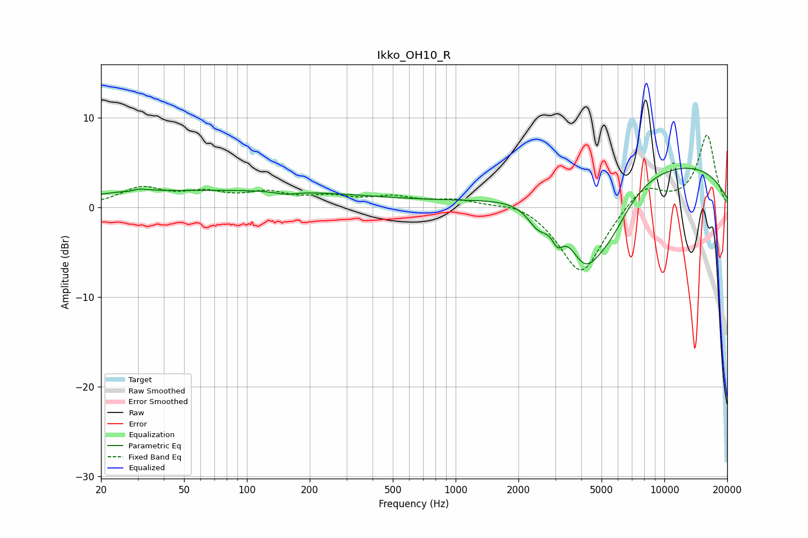

# Ikko_OH10_R
See [usage instructions](https://github.com/jaakkopasanen/AutoEq#usage) for more options and info.

### Parametric EQs
Apply preamp of -4.5 dB when using parametric equalizer.

|   # | Type    |   Fc (Hz) |    Q |   Gain (dB) |
|-----|---------|-----------|------|-------------|
|   1 | Peaking |        28 | 3.64 |        -1.8 |
|   2 | Peaking |        28 | 3.23 |         2   |
|   3 | Peaking |        70 | 0.18 |         1.9 |
|   4 | Peaking |       153 | 3.01 |        -0.3 |
|   5 | Peaking |       966 | 0.31 |         0.4 |
|   6 | Peaking |      2493 | 2.69 |        -2.5 |
|   7 | Peaking |      3081 | 5.1  |        -2.1 |
|   8 | Peaking |      4146 | 1.73 |        -6.4 |
|   9 | Peaking |      5409 | 1.27 |        -5   |
|  10 | Peaking |     10000 | 0.26 |         5.1 |

### Fixed Band EQs
When using fixed band (also called graphic) equalizer, apply preamp of **-8.2 dB** (if available) and set gains manually with these parameters.

|   # | Type    |   Fc (Hz) |    Q |   Gain (dB) |
|-----|---------|-----------|------|-------------|
|   1 | Peaking |        31 | 1.41 |         2   |
|   2 | Peaking |        62 | 1.41 |         1.3 |
|   3 | Peaking |       125 | 1.41 |         1.4 |
|   4 | Peaking |       250 | 1.41 |         1   |
|   5 | Peaking |       500 | 1.41 |         1   |
|   6 | Peaking |      1000 | 1.41 |         0.8 |
|   7 | Peaking |      2000 | 1.41 |         0.8 |
|   8 | Peaking |      4000 | 1.41 |        -7.6 |
|   9 | Peaking |      8000 | 1.41 |         2.6 |
|  10 | Peaking |     16000 | 1.41 |         8.1 |

### Graphs

