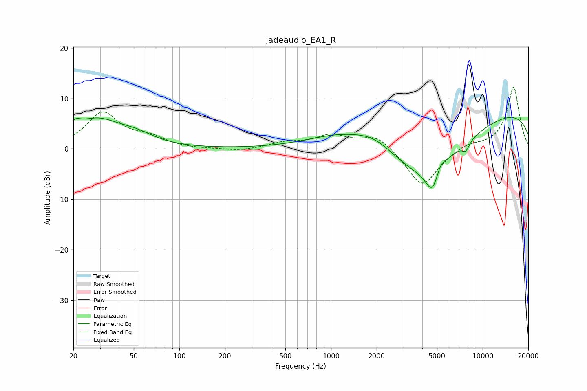

# Jadeaudio_EA1_R
See [usage instructions](https://github.com/jaakkopasanen/AutoEq#usage) for more options and info.

### Parametric EQs
Apply preamp of -6.3 dB when using parametric equalizer.

|   # | Type    |   Fc (Hz) |    Q |   Gain (dB) |
|-----|---------|-----------|------|-------------|
|   1 | Peaking |        21 | 4.06 |         1.7 |
|   2 | Peaking |        28 | 0.9  |         5.4 |
|   3 | Peaking |        52 | 1.19 |         1.7 |
|   4 | Peaking |      1173 | 0.63 |         3.3 |
|   5 | Peaking |      1946 | 1.05 |         2.8 |
|   6 | Peaking |      4003 | 0.48 |       -11.8 |
|   7 | Peaking |      4673 | 3.11 |        -5.3 |
|   8 | Peaking |      5262 | 4.3  |         1.9 |
|   9 | Peaking |      7760 | 5.45 |        -1.7 |
|  10 | Peaking |      9921 | 0.18 |         8.6 |

### Fixed Band EQs
When using fixed band (also called graphic) equalizer, apply preamp of **-12.3 dB** (if available) and set gains manually with these parameters.

|   # | Type    |   Fc (Hz) |    Q |   Gain (dB) |
|-----|---------|-----------|------|-------------|
|   1 | Peaking |        31 | 1.41 |         7   |
|   2 | Peaking |        62 | 1.41 |         1.9 |
|   3 | Peaking |       125 | 1.41 |        -0.1 |
|   4 | Peaking |       250 | 1.41 |        -0.5 |
|   5 | Peaking |       500 | 1.41 |         1.1 |
|   6 | Peaking |      1000 | 1.41 |         2.5 |
|   7 | Peaking |      2000 | 1.41 |         2.9 |
|   8 | Peaking |      4000 | 1.41 |        -7.7 |
|   9 | Peaking |      8000 | 1.41 |         1.1 |
|  10 | Peaking |     16000 | 1.41 |        12.3 |

### Graphs

