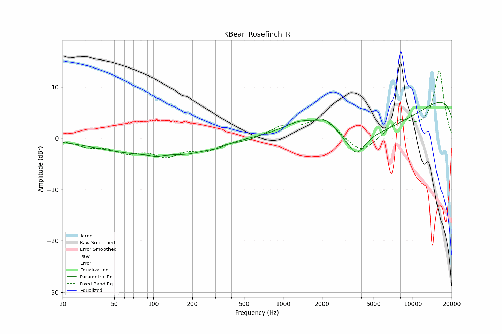

# KBear_Rosefinch_R
See [usage instructions](https://github.com/jaakkopasanen/AutoEq#usage) for more options and info.

### Parametric EQs
Apply preamp of -7.1 dB when using parametric equalizer.

|   # | Type    |   Fc (Hz) |    Q |   Gain (dB) |
|-----|---------|-----------|------|-------------|
|   1 | Peaking |        79 | 0.42 |        -2.8 |
|   2 | Peaking |       105 | 3.4  |        -0.4 |
|   3 | Peaking |       180 | 1.15 |        -0.8 |
|   4 | Peaking |       215 | 1.11 |        -0.5 |
|   5 | Peaking |       310 | 1.97 |        -0.7 |
|   6 | Peaking |      1450 | 0.76 |         4.6 |
|   7 | Peaking |      2194 | 2.21 |         1.9 |
|   8 | Peaking |      3676 | 2.22 |        -4   |
|   9 | Peaking |      5278 | 0.26 |       -10.3 |
|  10 | Peaking |     10000 | 0.18 |        12.8 |

### Fixed Band EQs
When using fixed band (also called graphic) equalizer, apply preamp of **-13.2 dB** (if available) and set gains manually with these parameters.

|   # | Type    |   Fc (Hz) |    Q |   Gain (dB) |
|-----|---------|-----------|------|-------------|
|   1 | Peaking |        31 | 1.41 |        -1.4 |
|   2 | Peaking |        62 | 1.41 |        -2.3 |
|   3 | Peaking |       125 | 1.41 |        -3   |
|   4 | Peaking |       250 | 1.41 |        -2   |
|   5 | Peaking |       500 | 1.41 |        -0.5 |
|   6 | Peaking |      1000 | 1.41 |         2.1 |
|   7 | Peaking |      2000 | 1.41 |         3.8 |
|   8 | Peaking |      4000 | 1.41 |        -3.3 |
|   9 | Peaking |      8000 | 1.41 |         3.1 |
|  10 | Peaking |     16000 | 1.41 |        13.1 |

### Graphs

