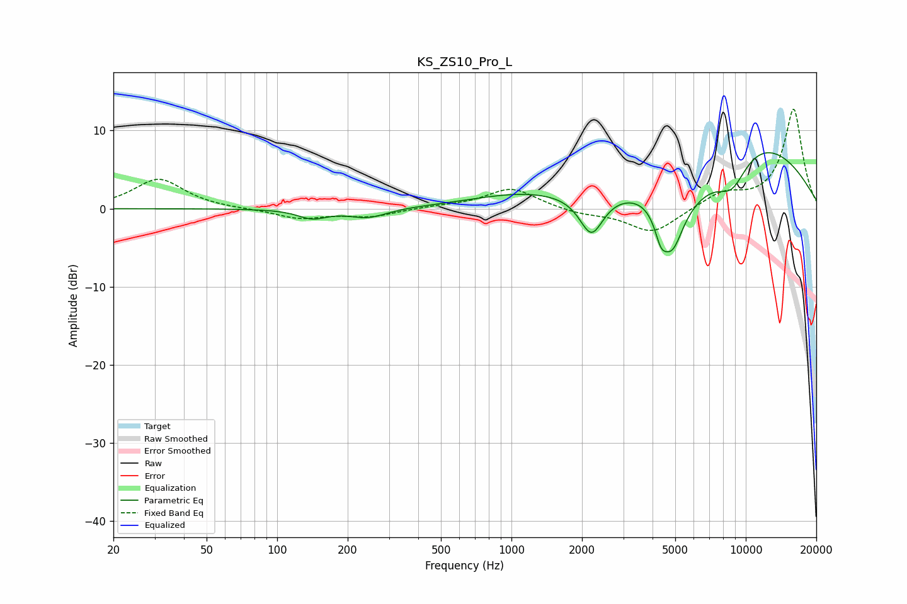

# KS_ZS10_Pro_L
See [usage instructions](https://github.com/jaakkopasanen/AutoEq#usage) for more options and info.

### Parametric EQs
Apply preamp of -7.2 dB when using parametric equalizer.

|   # | Type    |   Fc (Hz) |    Q |   Gain (dB) |
|-----|---------|-----------|------|-------------|
|   1 | Peaking |       141 | 2.3  |        -1.2 |
|   2 | Peaking |       244 | 1.72 |        -1.2 |
|   3 | Peaking |      1111 | 0.62 |         1.7 |
|   4 | Peaking |      2195 | 2.77 |        -5.2 |
|   5 | Peaking |      4337 | 5.56 |        -2.6 |
|   6 | Peaking |      4838 | 2.6  |        -7.4 |
|   7 | Peaking |      6172 | 1.02 |        -3.1 |
|   8 | Peaking |      8723 | 1.88 |        -4.2 |
|   9 | Peaking |     10000 | 0.55 |         2.9 |
|  10 | Peaking |     10000 | 0.3  |         6.4 |

### Fixed Band EQs
When using fixed band (also called graphic) equalizer, apply preamp of **-12.8 dB** (if available) and set gains manually with these parameters.

|   # | Type    |   Fc (Hz) |    Q |   Gain (dB) |
|-----|---------|-----------|------|-------------|
|   1 | Peaking |        31 | 1.41 |         3.8 |
|   2 | Peaking |        62 | 1.41 |        -0.1 |
|   3 | Peaking |       125 | 1.41 |        -1.2 |
|   4 | Peaking |       250 | 1.41 |        -1   |
|   5 | Peaking |       500 | 1.41 |         0.3 |
|   6 | Peaking |      1000 | 1.41 |         2.6 |
|   7 | Peaking |      2000 | 1.41 |        -0.6 |
|   8 | Peaking |      4000 | 1.41 |        -3.2 |
|   9 | Peaking |      8000 | 1.41 |         1.9 |
|  10 | Peaking |     16000 | 1.41 |        12.8 |

### Graphs

