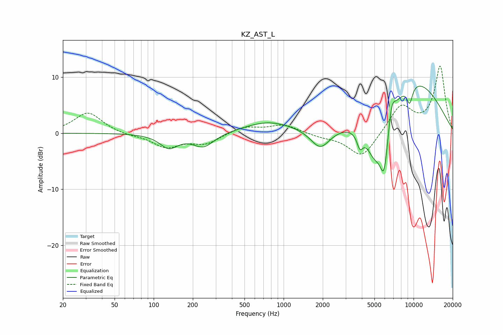

# KZ_AST_L
See [usage instructions](https://github.com/jaakkopasanen/AutoEq#usage) for more options and info.

### Parametric EQs
Apply preamp of -8.5 dB when using parametric equalizer.

|   # | Type    |   Fc (Hz) |    Q |   Gain (dB) |
|-----|---------|-----------|------|-------------|
|   1 | Peaking |       131 | 2.02 |        -2.5 |
|   2 | Peaking |       242 | 1.72 |        -2.5 |
|   3 | Peaking |       766 | 0.75 |         2   |
|   4 | Peaking |      1916 | 1.91 |        -3.6 |
|   5 | Peaking |      3866 | 5.97 |        -2.6 |
|   6 | Peaking |      5000 | 1.97 |        -6.8 |
|   7 | Peaking |      5938 | 3.9  |        -9.4 |
|   8 | Peaking |      6780 | 5.16 |         3.6 |
|   9 | Peaking |      9331 | 5.7  |        -3   |
|  10 | Peaking |     10000 | 0.47 |         9.4 |

### Fixed Band EQs
When using fixed band (also called graphic) equalizer, apply preamp of **-12.1 dB** (if available) and set gains manually with these parameters.

|   # | Type    |   Fc (Hz) |    Q |   Gain (dB) |
|-----|---------|-----------|------|-------------|
|   1 | Peaking |        31 | 1.41 |         3.7 |
|   2 | Peaking |        62 | 1.41 |        -0.4 |
|   3 | Peaking |       125 | 1.41 |        -2.4 |
|   4 | Peaking |       250 | 1.41 |        -1.8 |
|   5 | Peaking |       500 | 1.41 |         1.2 |
|   6 | Peaking |      1000 | 1.41 |         1.5 |
|   7 | Peaking |      2000 | 1.41 |        -0.5 |
|   8 | Peaking |      4000 | 1.41 |        -4.5 |
|   9 | Peaking |      8000 | 1.41 |         4.9 |
|  10 | Peaking |     16000 | 1.41 |        11.8 |

### Graphs

