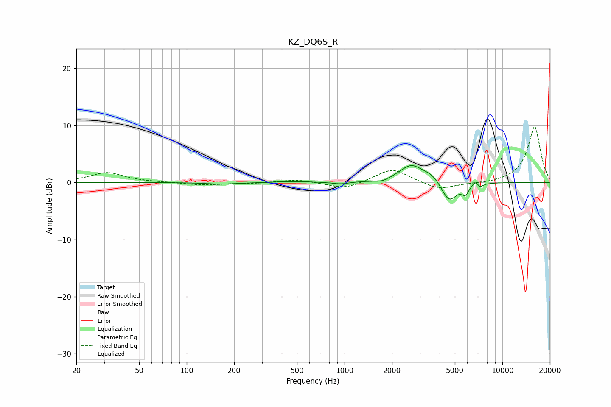

# KZ_DQ6S_R
See [usage instructions](https://github.com/jaakkopasanen/AutoEq#usage) for more options and info.

### Parametric EQs
Apply preamp of -3.1 dB when using parametric equalizer.

|   # | Type    |   Fc (Hz) |    Q |   Gain (dB) |
|-----|---------|-----------|------|-------------|
|   1 | Peaking |       167 | 1.53 |        -0.3 |
|   2 | Peaking |       468 | 1.73 |         0.2 |
|   3 | Peaking |       945 | 2.9  |        -0.4 |
|   4 | Peaking |      1728 | 3.41 |        -0.4 |
|   5 | Peaking |      2646 | 1.87 |         3   |
|   6 | Peaking |      3612 | 2.46 |         1.2 |
|   7 | Peaking |      4590 | 2.78 |        -3.7 |
|   8 | Peaking |      5838 | 6    |        -1.6 |
|   9 | Peaking |      6825 | 5.97 |         1.4 |
|  10 | Peaking |      7117 | 6    |        -1.2 |

### Fixed Band EQs
When using fixed band (also called graphic) equalizer, apply preamp of **-9.8 dB** (if available) and set gains manually with these parameters.

|   # | Type    |   Fc (Hz) |    Q |   Gain (dB) |
|-----|---------|-----------|------|-------------|
|   1 | Peaking |        31 | 1.41 |         1.7 |
|   2 | Peaking |        62 | 1.41 |         0   |
|   3 | Peaking |       125 | 1.41 |        -0.4 |
|   4 | Peaking |       250 | 1.41 |        -0.2 |
|   5 | Peaking |       500 | 1.41 |         0.5 |
|   6 | Peaking |      1000 | 1.41 |        -1.2 |
|   7 | Peaking |      2000 | 1.41 |         2.5 |
|   8 | Peaking |      4000 | 1.41 |        -1.4 |
|   9 | Peaking |      8000 | 1.41 |        -0.2 |
|  10 | Peaking |     16000 | 1.41 |         9.8 |

### Graphs

