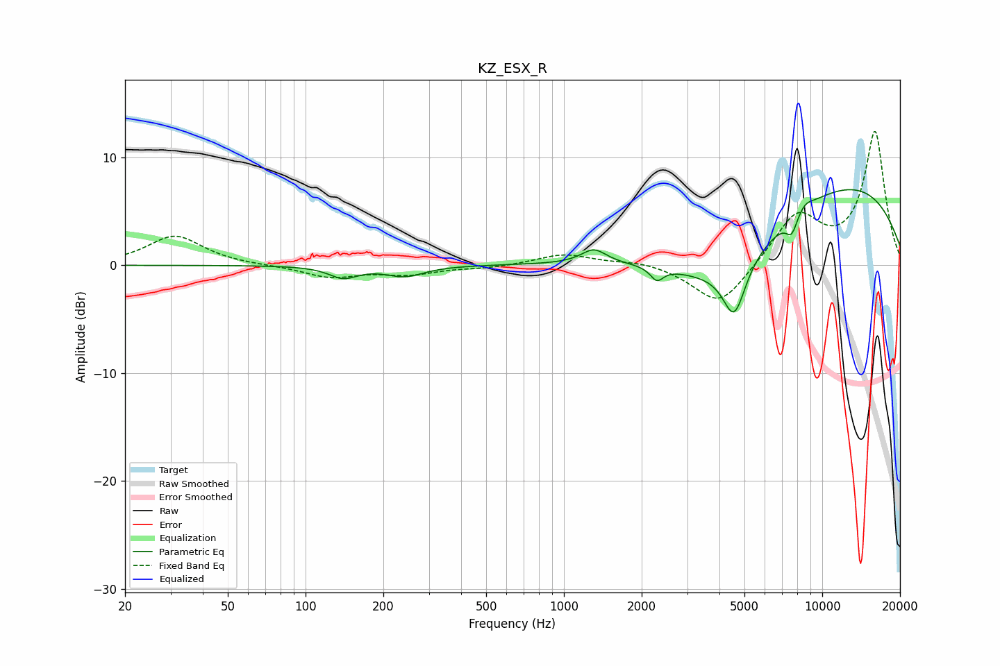

# KZ_ESX_R
See [usage instructions](https://github.com/jaakkopasanen/AutoEq#usage) for more options and info.

### Parametric EQs
Apply preamp of -7.1 dB when using parametric equalizer.

|   # | Type    |   Fc (Hz) |    Q |   Gain (dB) |
|-----|---------|-----------|------|-------------|
|   1 | Peaking |       140 | 2.58 |        -1.1 |
|   2 | Peaking |       242 | 1.92 |        -1   |
|   3 | Peaking |      1306 | 2.92 |         1.3 |
|   4 | Peaking |      2291 | 5.75 |        -1.2 |
|   5 | Peaking |      4072 | 0.53 |        -7.8 |
|   6 | Peaking |      4565 | 3.22 |        -4.9 |
|   7 | Peaking |      7622 | 5.99 |        -1.7 |
|   8 | Peaking |      8042 | 0.24 |         6.2 |
|   9 | Peaking |      8567 | 4.2  |         0.6 |
|  10 | Peaking |      9652 | 0.18 |         3.2 |

### Fixed Band EQs
When using fixed band (also called graphic) equalizer, apply preamp of **-12.5 dB** (if available) and set gains manually with these parameters.

|   # | Type    |   Fc (Hz) |    Q |   Gain (dB) |
|-----|---------|-----------|------|-------------|
|   1 | Peaking |        31 | 1.41 |         2.7 |
|   2 | Peaking |        62 | 1.41 |        -0   |
|   3 | Peaking |       125 | 1.41 |        -1.1 |
|   4 | Peaking |       250 | 1.41 |        -0.8 |
|   5 | Peaking |       500 | 1.41 |        -0.2 |
|   6 | Peaking |      1000 | 1.41 |         1   |
|   7 | Peaking |      2000 | 1.41 |         0.4 |
|   8 | Peaking |      4000 | 1.41 |        -4   |
|   9 | Peaking |      8000 | 1.41 |         4.6 |
|  10 | Peaking |     16000 | 1.41 |        12.3 |

### Graphs

