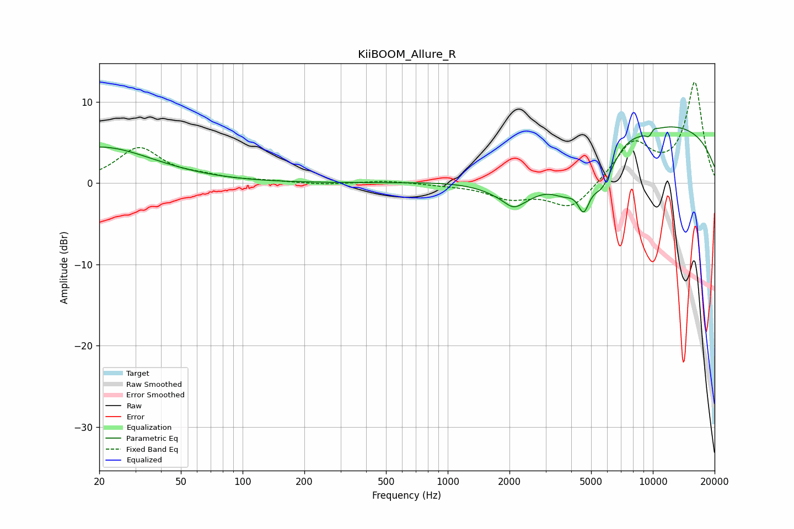

# KiiBOOM_Allure_R
See [usage instructions](https://github.com/jaakkopasanen/AutoEq#usage) for more options and info.

### Parametric EQs
Apply preamp of -7.0 dB when using parametric equalizer.

|   # | Type    |   Fc (Hz) |    Q |   Gain (dB) |
|-----|---------|-----------|------|-------------|
|   1 | Peaking |        20 | 0.54 |         4.4 |
|   2 | Peaking |      2090 | 3.46 |        -0.9 |
|   3 | Peaking |      2223 | 1.04 |        -4.2 |
|   4 | Peaking |      3765 | 1.75 |        -3.5 |
|   5 | Peaking |      4601 | 4.71 |        -3.9 |
|   6 | Peaking |      5656 | 2.3  |        -4.8 |
|   7 | Peaking |      9238 | 5.99 |         0.9 |
|   8 | Peaking |      9526 | 4.13 |        -2.3 |
|   9 | Peaking |     10000 | 0.22 |         7.5 |
|  10 | Peaking |     10000 | 5.71 |         1.1 |

### Fixed Band EQs
When using fixed band (also called graphic) equalizer, apply preamp of **-12.5 dB** (if available) and set gains manually with these parameters.

|   # | Type    |   Fc (Hz) |    Q |   Gain (dB) |
|-----|---------|-----------|------|-------------|
|   1 | Peaking |        31 | 1.41 |         4.3 |
|   2 | Peaking |        62 | 1.41 |         0.6 |
|   3 | Peaking |       125 | 1.41 |         0.2 |
|   4 | Peaking |       250 | 1.41 |        -0.2 |
|   5 | Peaking |       500 | 1.41 |         0.3 |
|   6 | Peaking |      1000 | 1.41 |        -0.2 |
|   7 | Peaking |      2000 | 1.41 |        -1.7 |
|   8 | Peaking |      4000 | 1.41 |        -3.3 |
|   9 | Peaking |      8000 | 1.41 |         4.9 |
|  10 | Peaking |     16000 | 1.41 |        12.3 |

### Graphs

