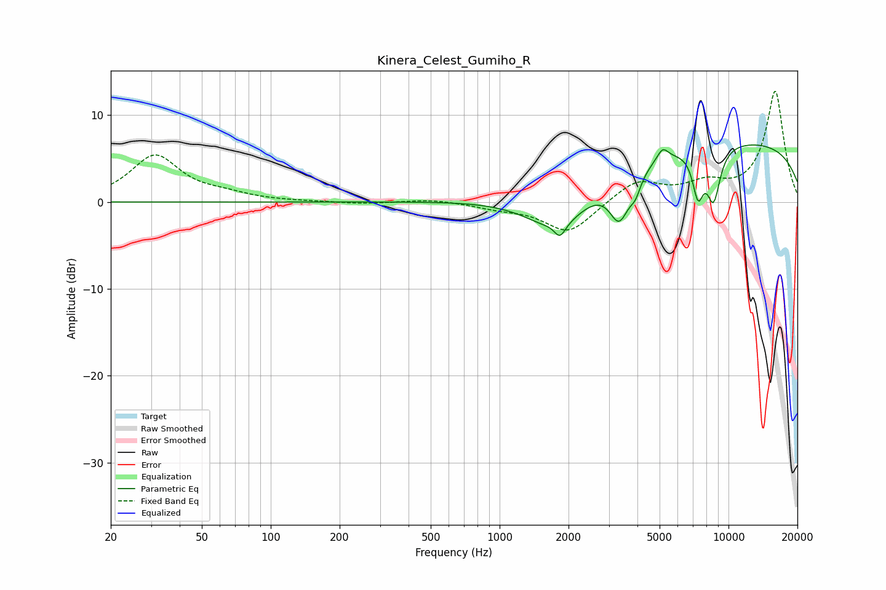

# Kinera_Celest_Gumiho_R
See [usage instructions](https://github.com/jaakkopasanen/AutoEq#usage) for more options and info.

### Parametric EQs
Apply preamp of -6.7 dB when using parametric equalizer.

|   # | Type    |   Fc (Hz) |    Q |   Gain (dB) |
|-----|---------|-----------|------|-------------|
|   1 | Peaking |      1669 | 4.41 |         0.2 |
|   2 | Peaking |      1794 | 1    |        -5.3 |
|   3 | Peaking |      1834 | 5.92 |        -1.5 |
|   4 | Peaking |      3323 | 3.37 |        -4.3 |
|   5 | Peaking |      3501 | 2.46 |        -1   |
|   6 | Peaking |      3925 | 5.95 |        -1.6 |
|   7 | Peaking |      5155 | 5.78 |         1.4 |
|   8 | Peaking |      7359 | 5.51 |        -4.9 |
|   9 | Peaking |      8603 | 4.3  |        -6   |
|  10 | Peaking |      9674 | 0.18 |         7.1 |

### Fixed Band EQs
When using fixed band (also called graphic) equalizer, apply preamp of **-12.8 dB** (if available) and set gains manually with these parameters.

|   # | Type    |   Fc (Hz) |    Q |   Gain (dB) |
|-----|---------|-----------|------|-------------|
|   1 | Peaking |        31 | 1.41 |         5.3 |
|   2 | Peaking |        62 | 1.41 |         0.6 |
|   3 | Peaking |       125 | 1.41 |         0   |
|   4 | Peaking |       250 | 1.41 |        -0.2 |
|   5 | Peaking |       500 | 1.41 |         0.3 |
|   6 | Peaking |      1000 | 1.41 |        -0.6 |
|   7 | Peaking |      2000 | 1.41 |        -3.6 |
|   8 | Peaking |      4000 | 1.41 |         2.5 |
|   9 | Peaking |      8000 | 1.41 |         1.8 |
|  10 | Peaking |     16000 | 1.41 |        12.7 |

### Graphs

