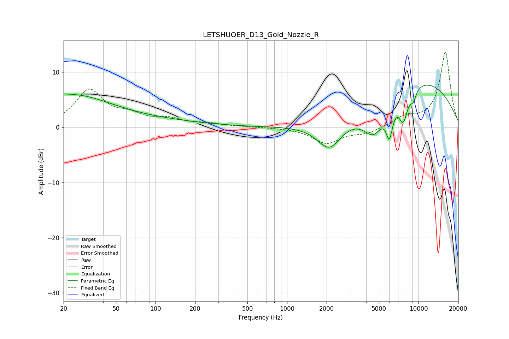

# LETSHUOER_D13_Gold_Nozzle_R
See [usage instructions](https://github.com/jaakkopasanen/AutoEq#usage) for more options and info.

### Parametric EQs
Apply preamp of -7.7 dB when using parametric equalizer.

|   # | Type    |   Fc (Hz) |    Q |   Gain (dB) |
|-----|---------|-----------|------|-------------|
|   1 | Peaking |        20 | 4.45 |         1   |
|   2 | Peaking |        20 | 5.38 |        -0.6 |
|   3 | Peaking |        23 | 0.48 |         5.5 |
|   4 | Peaking |        96 | 0.38 |         1   |
|   5 | Peaking |      2099 | 1.51 |        -5   |
|   6 | Peaking |      4553 | 1.68 |        -5.5 |
|   7 | Peaking |      6007 | 5.55 |        -5.2 |
|   8 | Peaking |      7666 | 3.81 |        -5.2 |
|   9 | Peaking |      9132 | 5.95 |        -1.8 |
|  10 | Peaking |     10000 | 0.33 |         8.5 |

### Fixed Band EQs
When using fixed band (also called graphic) equalizer, apply preamp of **-13.7 dB** (if available) and set gains manually with these parameters.

|   # | Type    |   Fc (Hz) |    Q |   Gain (dB) |
|-----|---------|-----------|------|-------------|
|   1 | Peaking |        31 | 1.41 |         6.6 |
|   2 | Peaking |        62 | 1.41 |         1.7 |
|   3 | Peaking |       125 | 1.41 |         1.3 |
|   4 | Peaking |       250 | 1.41 |         0.6 |
|   5 | Peaking |       500 | 1.41 |         0.1 |
|   6 | Peaking |      1000 | 1.41 |        -0   |
|   7 | Peaking |      2000 | 1.41 |        -2.8 |
|   8 | Peaking |      4000 | 1.41 |        -1   |
|   9 | Peaking |      8000 | 1.41 |         1.7 |
|  10 | Peaking |     16000 | 1.41 |        13.6 |

### Graphs

