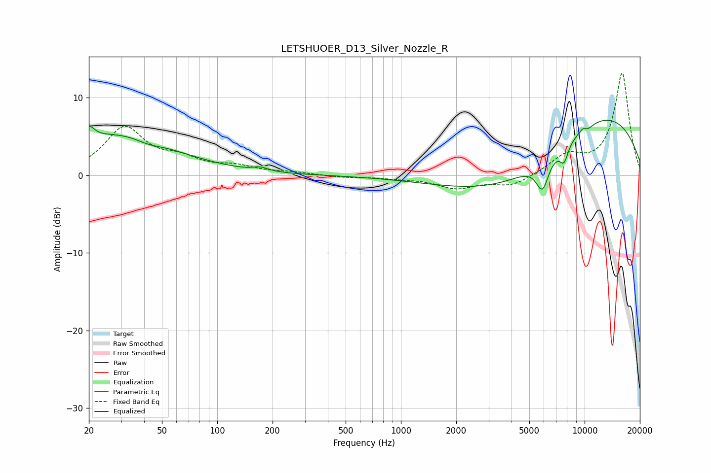

# LETSHUOER_D13_Silver_Nozzle_R
See [usage instructions](https://github.com/jaakkopasanen/AutoEq#usage) for more options and info.

### Parametric EQs
Apply preamp of -7.2 dB when using parametric equalizer.

|   # | Type    |   Fc (Hz) |    Q |   Gain (dB) |
|-----|---------|-----------|------|-------------|
|   1 | Peaking |        20 | 5.04 |         1.6 |
|   2 | Peaking |        28 | 0.45 |         5.2 |
|   3 | Peaking |        42 | 2.03 |        -0.6 |
|   4 | Peaking |       172 | 3.72 |         0.5 |
|   5 | Peaking |      4252 | 0.41 |        -6.4 |
|   6 | Peaking |      5899 | 3.93 |        -3.9 |
|   7 | Peaking |      7729 | 5.43 |        -2.3 |
|   8 | Peaking |      9797 | 5.48 |         1.1 |
|   9 | Peaking |     10000 | 3.41 |        -1.1 |
|  10 | Peaking |     10000 | 0.27 |         9.6 |

### Fixed Band EQs
When using fixed band (also called graphic) equalizer, apply preamp of **-13.3 dB** (if available) and set gains manually with these parameters.

|   # | Type    |   Fc (Hz) |    Q |   Gain (dB) |
|-----|---------|-----------|------|-------------|
|   1 | Peaking |        31 | 1.41 |         6   |
|   2 | Peaking |        62 | 1.41 |         1.7 |
|   3 | Peaking |       125 | 1.41 |         1   |
|   4 | Peaking |       250 | 1.41 |         0.3 |
|   5 | Peaking |       500 | 1.41 |        -0.3 |
|   6 | Peaking |      1000 | 1.41 |        -0.3 |
|   7 | Peaking |      2000 | 1.41 |        -1.6 |
|   8 | Peaking |      4000 | 1.41 |        -1.4 |
|   9 | Peaking |      8000 | 1.41 |         2.3 |
|  10 | Peaking |     16000 | 1.41 |        13.2 |

### Graphs

