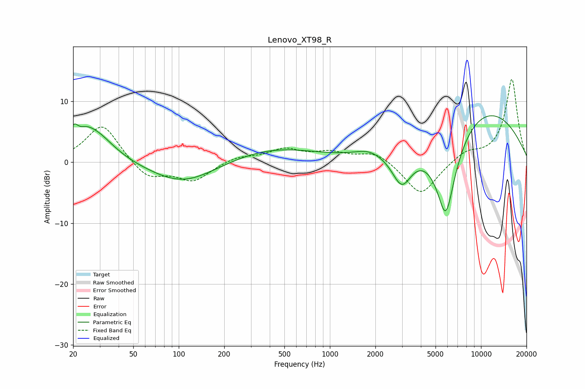

# Lenovo_XT98_R
See [usage instructions](https://github.com/jaakkopasanen/AutoEq#usage) for more options and info.

### Parametric EQs
Apply preamp of -7.7 dB when using parametric equalizer.

|   # | Type    |   Fc (Hz) |    Q |   Gain (dB) |
|-----|---------|-----------|------|-------------|
|   1 | Peaking |        20 | 4.81 |         2.8 |
|   2 | Peaking |        24 | 2.68 |         1.3 |
|   3 | Peaking |        28 | 1.14 |         4.7 |
|   4 | Peaking |       107 | 0.66 |        -3.7 |
|   5 | Peaking |       417 | 0.49 |         2.4 |
|   6 | Peaking |      1795 | 1.67 |         1   |
|   7 | Peaking |      2991 | 2.1  |        -5.8 |
|   8 | Peaking |      5848 | 1.72 |       -16.5 |
|   9 | Peaking |      8011 | 0.44 |         4.3 |
|  10 | Peaking |     10000 | 0.3  |         6.2 |

### Fixed Band EQs
When using fixed band (also called graphic) equalizer, apply preamp of **-13.7 dB** (if available) and set gains manually with these parameters.

|   # | Type    |   Fc (Hz) |    Q |   Gain (dB) |
|-----|---------|-----------|------|-------------|
|   1 | Peaking |        31 | 1.41 |         6.4 |
|   2 | Peaking |        62 | 1.41 |        -2.8 |
|   3 | Peaking |       125 | 1.41 |        -3   |
|   4 | Peaking |       250 | 1.41 |         0.9 |
|   5 | Peaking |       500 | 1.41 |         2   |
|   6 | Peaking |      1000 | 1.41 |         1.4 |
|   7 | Peaking |      2000 | 1.41 |         1.8 |
|   8 | Peaking |      4000 | 1.41 |        -5.6 |
|   9 | Peaking |      8000 | 1.41 |         1.6 |
|  10 | Peaking |     16000 | 1.41 |        13.7 |

### Graphs

