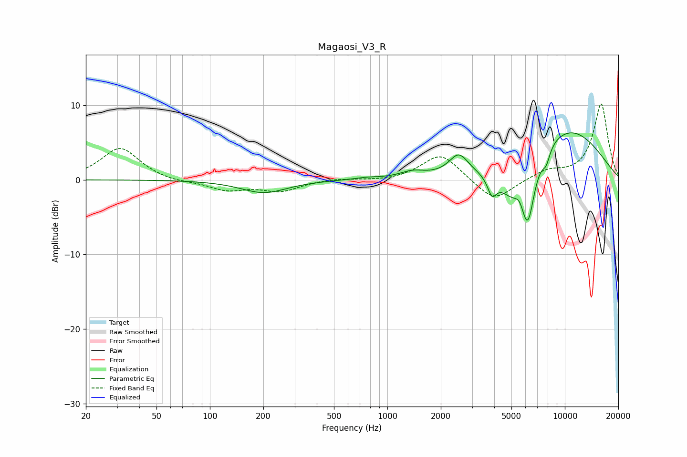

# Magaosi_V3_R
See [usage instructions](https://github.com/jaakkopasanen/AutoEq#usage) for more options and info.

### Parametric EQs
Apply preamp of -6.4 dB when using parametric equalizer.

|   # | Type    |   Fc (Hz) |    Q |   Gain (dB) |
|-----|---------|-----------|------|-------------|
|   1 | Peaking |       202 | 1.1  |        -1.7 |
|   2 | Peaking |       758 | 2.08 |         0.2 |
|   3 | Peaking |      1384 | 2.06 |         0.8 |
|   4 | Peaking |      2522 | 2.64 |         2.8 |
|   5 | Peaking |      3885 | 5.59 |        -2.4 |
|   6 | Peaking |      5020 | 1.64 |        -4.1 |
|   7 | Peaking |      5562 | 5.72 |         1   |
|   8 | Peaking |      6183 | 3.48 |        -8   |
|   9 | Peaking |      7839 | 5.91 |        -1.8 |
|  10 | Peaking |     10000 | 0.49 |         7   |

### Fixed Band EQs
When using fixed band (also called graphic) equalizer, apply preamp of **-10.3 dB** (if available) and set gains manually with these parameters.

|   # | Type    |   Fc (Hz) |    Q |   Gain (dB) |
|-----|---------|-----------|------|-------------|
|   1 | Peaking |        31 | 1.41 |         4.3 |
|   2 | Peaking |        62 | 1.41 |        -0.4 |
|   3 | Peaking |       125 | 1.41 |        -1.3 |
|   4 | Peaking |       250 | 1.41 |        -1.4 |
|   5 | Peaking |       500 | 1.41 |         0.2 |
|   6 | Peaking |      1000 | 1.41 |        -0.2 |
|   7 | Peaking |      2000 | 1.41 |         3.6 |
|   8 | Peaking |      4000 | 1.41 |        -3   |
|   9 | Peaking |      8000 | 1.41 |         1.2 |
|  10 | Peaking |     16000 | 1.41 |        10.2 |

### Graphs

